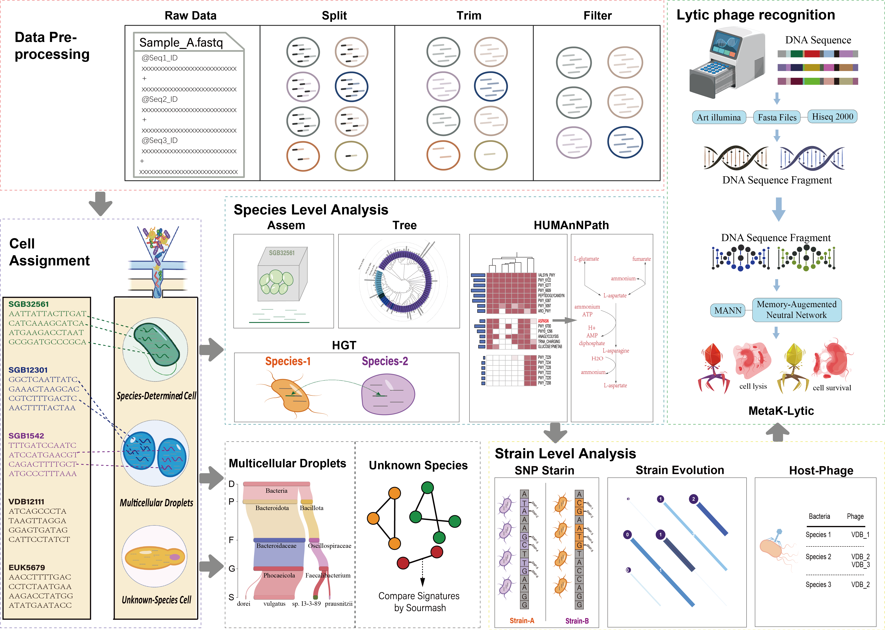

# MetaSAG


## What is it?

**Microbial single-amplified genome (SAG) droplet sequencing technology** can generate tens of thousands of droplet short-read sequencing data at a time, elevating microbial research resolution to the single-cell level.
We offer **MetaSAG**, a comprehensive integrated tool that can parse microbial SAG data from raw data to the strain level to decipher the functional ecology of microbial dark matter, with broad implications for microbial ecology and phage therapy.




## Table of Contents

- [Main Features](#Main-Features)
- [Installation and requirements](#Installation-and-requirements)
- [Usage](#Usage)
- [FAQs](#FAQs)
- [License](#License)
- [Contact](#Contact)


## Main Features
- Here are just a few of the things that **MetaSAG** does well:

  - According to the distribution of short reading segments of droplets in the sample,
    low-quality droplets are removed, and the soft threshold is more scientific.
  - The classification and annotation of a single cell are flexible, and it is not
    necessary to rely on the similarity between cells for clustering.
  - Annotation method has interpretable biological significance.
  - Annotations depend on [**MetaPhlAn4**][MetaPhlAn4].
  - Multi-cell droplets and unknown classified droplets can be identified.
  - The definition of cell category is flexible, and the default threshold or custom threshold can be used.
  - Assembling genomes of known classified cell boxes is efficient and accurate.
  - The main phage viruses in the sample can be identified.
  - Species- and strain-level streamlined downstream functional analysis (phylogenetic tree, SNP classification strain and evolution analysis, HGT level gene transfer)
  - According to Uniref90 features and using [**HuMann3 Tool**][HuMann3], the designated cells are clustered, and the similarity between
    cell clusters is analyzed from the functional point of view.
  - Phage lytic ability prediction (MetaK-Lytic).

   [MetaPhlAn4]: https://github.com/biobakery/MetaPhlAn
   [HuMann3]: https://github.com/biobakery/humann


## Installation and requirements

- **Install**
```
pip install MetaSAG
```

- **Requirements**
```
MetaSAG requires Python version >= 3.8.0, R version >= 4.2.2, 
other tools or packages you need and their version we list here:
```
[Tools we recommand](READMESource/ReadMETool.md)


## Usage
-  [**Step 1. Distribute the reads in the sample to a file of individual droplets.**](READMESource/READMEUsage1.md)
-  [**Step 2. Filter low-quality cells**](READMESource/READMEUsage2.md)
-  [**Step 3. MetaPhlAn4 annotates the reads and classifies droplets**](READMESource/READMEUsage3.md)
-  [**Step 4. Quality control and integration annotation of assembled genome**](READMESource/READMEUsage4.md)
-  [**Step 5. Build phylogenetic tree**](READMESource/READMEUsage5.md)
-  [**Step 6. Species to Strain resolved genomes**](READMESource/READMEUsage6.md)
-  [**Step 7. Horizontal Gene Transfer**](READMESource/READMEUsage7.md)
-  [**Step 8. HUMAnN Path**](READMESource/READMEUsage8.md)
-  [**Step 9. Droplet clustering of potentially unknown species**](READMESource/READMEUsage9.md)
-  [**Step 10. SGB Strain Evolution Analysis Function**](READMESource/READMEUsage10.md)
-  [**Step 11. MetaK-Lytic**](READMESource/READMEUsage11.md)


## FAQs
This section answers some of the users' most recurrent doubts when running MetaSAG.


## License
MetaSAG is free for academic use only.


## Contact
If you have any comments or suggestions about MetaSAG please raise an issue or contact us:

Professor Liang Cheng: liangcheng@hrbmu.edu.cn


