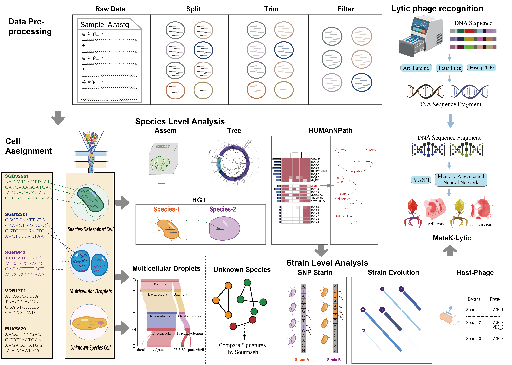

# MetaSAG


## What is it?

**Microbial single-amplified genome (SAG) droplet sequencing technology** can generate tens of thousands of droplet short-read sequencing data at a time, elevating microbial research resolution to the single-cell level.
We offer **MetaSAG**, a comprehensive integrated tool that can parse microbial SAG data from raw data to the strain level to decipher the functional ecology of microbial dark matter, with broad implications for microbial ecology and phage therapy.




## Table of Contents

- [Main Features](#Main-Features)
- [Requirements and installation](#Requirements-and-installation)
- [Quick-start workflow demo](#Quick-start-workflow-demo)
- [Usage](#Usage)
- [FAQs](#FAQs)
- [License](#License)
- [Contact](#Contact)


## Main Features
- Here are just a few of the things that **MetaSAG** does well:

  - According to the distribution of short reading segments of droplets in the sample,
    low-quality droplets are removed, and the soft threshold is more scientific.
  - The classification and annotation of a single cell are flexible, and it is not
    necessary to rely on the similarity between cells for clustering.
  - Annotation method has interpretable biological significance.
  - Annotations depend on [**MetaPhlAn4**][MetaPhlAn4].
  - Multi-cell droplets and unknown classified droplets can be identified.
  - The definition of cell category is flexible, and the default threshold or custom threshold can be used.
  - Assembling genomes of known classified cell boxes is efficient and accurate.
  - The main phage viruses in the sample can be identified.
  - Species- and strain-level streamlined downstream functional analysis (phylogenetic tree, SNP classification strain and evolution analysis, HGT level gene transfer)
  - According to Uniref90 features and using [**HuMann3 Tool**][HuMann3], the designated cells are clustered, and the similarity between
    cell clusters is analyzed from the functional point of view.
  - Phage lytic ability prediction (MetaK-Lytic).

   [MetaPhlAn4]: https://github.com/biobakery/MetaPhlAn
   [HuMann3]: https://github.com/biobakery/humann


## Requirements and installation

- **Requirements**
```
MetaSAG requires Python version >= 3.8.0, R version >= 4.2.2,
other tools or packages you need and their version we list here:
```
[Tools we recommand](READMESource/ReadMETool.md)

The core Python/R dependencies used by MetaSAG scripts that run in the current environment are provided in `environment.yml`. External bioinformatics tools that are called through user-specified environments, such as MetaPhlAn, HUMAnN, Prokka, CD-HIT, Kraken, SPAdes, and anvi'o, should still be configured separately as described in the corresponding usage sections.

- **Install**

MetaSAG is currently under code review and has not yet been released on PyPI. A PyPI release will be provided soon. At this stage, MetaSAG can only be installed from the GitHub source code.

The recommended installation method is to create the conda environment from `environment.yml`, which installs MetaSAG together with the core R dependencies required by the R scripts that run in the current environment.

```bash
git clone https://github.com/liangcheng-hrbmu/MetaSAG.git
cd MetaSAG
conda env create -f environment.yml
conda activate metasag
Rscript setup_r.R
```

If you already have a suitable Python/R environment and only want to install the Python package, you can still use:

```bash
git clone https://github.com/liangcheng-hrbmu/MetaSAG.git
cd MetaSAG
pip install .
```


## Quick-start workflow demo

A lightweight Jupyter notebook is provided to demonstrate the main MetaSAG workflow using bundled example data:

- [MetaSAG_workflow_demo.ipynb](MetaSAG_workflow_demo.ipynb)

This notebook walks through the major steps of MetaSAG, including droplet read splitting, low-quality cell filtering, taxonomic assignment, unknown-species droplet clustering, genome quality control and annotation, phylogenetic tree construction, strain-level analysis, horizontal gene transfer analysis, and HUMAnN pathway analysis.

Please note that the example dataset is intentionally small and is mainly intended for workflow demonstration. Some downstream steps may generate limited outputs, empty results, or no complete test result files. For biological interpretation, users should run MetaSAG on their own datasets with sufficient sequencing depth and appropriate external database/tool configurations.


## Usage
-  [**Step 1. Distribute the reads in the sample to a file of individual droplets.**](READMESource/READMEUsage1.md)
-  [**Step 2. Filter low-quality cells**](READMESource/READMEUsage2.md)
-  [**Step 3. MetaPhlAn4 annotates the reads and classifies droplets**](READMESource/READMEUsage3.md)
-  [**Step 4. Droplet clustering of potentially unknown species**](READMESource/READMEUsage4.md)
-  [**Step 5. Quality control and integration annotation of assembled genome**](READMESource/READMEUsage5.md)
-  [**Step 6. Build phylogenetic tree**](READMESource/READMEUsage6.md)
-  [**Step 7. Species to Strain resolved genomes**](READMESource/READMEUsage7.md)
-  [**Step 8. Horizontal Gene Transfer**](READMESource/READMEUsage8.md)
-  [**Step 9. HUMAnN Path**](READMESource/READMEUsage9.md)
-  [**Step 10. SGB Strain Evolution Analysis Function**](READMESource/READMEUsage10.md)
-  [**Step 11. MetaK-Lytic**](READMESource/READMEUsage11.md)


## FAQs
This section answers some of the users' most recurrent doubts when running MetaSAG.


## License
MetaSAG is free for academic use only.


## Contact
If you have any comments or suggestions about MetaSAG please raise an issue or contact us:

Professor Liang Cheng: liangcheng@hrbmu.edu.cn


