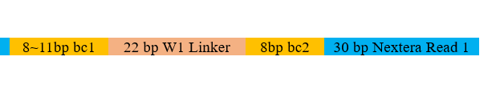

# Step 1. Distribute the reads in the sample to a file of individual droplets.

## Class：Barcode(InputFastq,resultDir='No',SamplePrefix='No')

- **Class Description:**

The Barcode class provides a complete workflow for barcode-based read processing. It stores the input FASTQ file path(s), creates default output paths, and connects barcode tagging, trimming, and cell-splitting steps.

Barcode identification is performed by a user-provided TagFunc. The BarcodeTagFunc.py file is provided as an example barcode recognition function. Users can modify or replace this function according to their own barcode design.

The barcode structure used by the example function is shown in the [`BarcodeTagFunc.py example`](#barcodetagfuncpy-example) section below.


- **Required Parameters:**
```
InputFastq      Location of short-read sequencing file(s).
                For single-end FASTQ: Filename must end with .fastq.
                For paired-end FASTQ: Filenames must end with _R1.fastq and _R2.fastq, provided as a list
                (e.g., ["sample_R1.fastq", "sample_R2.fastq"]).

resultDir       Output directory for barcode-tagged files, trimmed files, cell-split files, and read-count results.
```


- **Optional Parameters:**
```
SamplePrefix    Optional sample prefix used for output file names.
                If not provided, it is inferred from the input FASTQ file name.
```


- **Main Methods:**
```
Barcode.BarcodeTag(TagFunc=TagFunc)
                Adds barcode tags to read names and separates valid/error reads.

Barcode.trim()
                Trims the tagged FASTQ files using Trimmomatic.

Barcode.SplitTaggedFastqByCell()
                Splits tagged and trimmed reads into individual droplet/cell FASTQ files.

Barcode.SplitTaggedFastqByCellPath(CellDirt=CellDirt)
                Splits tagged reads according to a user-provided cell-to-path table.
```


- **Default Output Structure:**
```
resultDir/
├── temp/
│   ├── sample_R1.fastq
│   ├── sample_R2.fastq
│   ├── sample_error_R1.fastq
│   └── sample_error_R2.fastq
├── Trim/
│   ├── sample_R1.fastq
│   └── sample_R2.fastq
├── Cell/
│   ├── Cell<SampleID><BarcodeIndex>_R1.fastq
│   └── Cell<SampleID><BarcodeIndex>_R2.fastq
└── ReadsCount.csv
```
- **Example:** See the [Test Usage](#test-usage) section for an example run using the provided test data.

## Func 1：BarcodeTag(InputFastq,CellFastq,ErrorFastq,TagFunc)

- **Function Description:**

The BarcodeTag() function adds barcode tags to read names, writes valid reads to CellFastq, writes invalid reads to ErrorFastq, and returns a read-count table.

Barcode identification is performed by a user-provided TagFunc. TagFunc accepts one read sequence string and returns a tuple: (tag, status).

The [`BarcodeTagFunc.py`](../Example_data/Step_1to5_9_TestData/BarcodeTagFunc.py) file is provided as an example TagFunc source.


- **Required Parameters:**
```
InputFastq      Input FASTQ file(s).
                For single-end FASTQ: Filename must end with .fastq.
                For paired-end FASTQ: Filenames must end with _R1.fastq and _R2.fastq, provided as a list.

CellFastq       Output FASTQ path(s) for valid barcode-tagged reads.

ErrorFastq      Output FASTQ path(s) for reads that fail barcode recognition.

TagFunc         User-defined barcode tagging function.
                Accepts one read sequence string and returns (tag, status).
                Example return values:
                • ("Cell<SampleID><BarcodeIndex>", "Valid")
                • ("BC", "Error:BC")
                • ("Len", "Error:Len")
                • ("W1", "Error:W1")
```


- **Optional Parameters:**
```
RemoveInput     Whether to remove the input FASTQ file(s) after processing.
                Default: False

ReadsCountFile  Output file path for the barcode tagging count table.
                Default: 'No'

ChunkSize       Processing chunk size parameter.
                Default: 10000
```


- **Result:**

Returns a read-count table indexed by status and tag.


## Func 2：trim(InputFastq,TrimDir)

- **Function Description:**

The trim() function executes the trimmomatic.jar tool to perform adapter trimming on sequencing reads.


- **Required Parameters:**
```
InputFastq      Location of short-read sequencing file(s).
                • Single-end FASTQ: Filename suffix must be .fastq
                • Paired-end FASTQ: Filename suffixes must be _R1.fastq and _R2.fastq

TrimDir         Output directory for trimmed FASTQ files.
```


- **Optional Parameters:**
```
TrimPrefix      Output file prefix.
                If not provided, it is inferred from InputFastq.

ILLUMINACLIP    --  Default parameter (JAR config): 'TruSeq3-PE.fa:2:30:10:3:TRUE'

LEADING         --  Default parameter (JAR config): 25

TRAILING        --  Default parameter (JAR config): 3

SLIDINGWINDOW   --  Default parameter (JAR config): '4:20'

MINLEN          --  Default parameter (JAR config): 30

threads         --  Default parameter (JAR config): 12

RemoveInput     Whether to remove the input FASTQ file(s) after trimming.
                Default: False
```


## Func 3：SplitTaggedFastqByCell(CellFastq,CellBarnDir)

- **Function Description:**

The SplitTaggedFastqByCell() function splits tagged FASTQ files into individual droplet/cell FASTQ files.


- **Required Parameters:**
```
CellFastq       Tagged FASTQ file(s) to split.
                For single-end FASTQ: Filename must end with .fastq.
                For paired-end FASTQ: Filenames must end with _R1.fastq and _R2.fastq, provided as a list.

CellBarnDir     Output directory for individual droplet/cell FASTQ files.
```


- **Optional Parameters:**
```
CellList        Optional list of cell IDs to export.
                If not provided, all valid tagged cells are exported.

RemoveInput     Whether to remove the input FASTQ file(s) after splitting.
                Default: False
```


## Func 4：SplitTaggedFastqByCellPath(CellFastq,CellDirt)

- **Function Description:**

The SplitTaggedFastqByCellPath() function splits tagged FASTQ files according to a user-provided cell-to-path table.


- **Required Parameters:**
```
CellFastq       Tagged FASTQ file(s) to split.

CellDirt        A two-column pandas DataFrame.
                Column 1: Cell name
                Column 2: Output file path prefix without .fastq, _R1.fastq, or _R2.fastq suffix
```


- **Optional Parameters:**
```
RemoveInput     Whether to remove the input FASTQ file(s) after splitting.
                Default: False
```


## BarcodeTagFunc.py example

- **Function Description:**

BarcodeTagFunc.py is provided as a reference example of a barcode recognition function. It is not the only supported barcode recognition method. Users can modify this file or provide another TagFunc according to their own barcode structure.

The example function reads one sequence, identifies the barcode according to the barcode design, and returns a cell tag and a recognition status. For valid reads, the returned cell tag is used to name the output cell FASTQ files. For invalid reads, the function returns an error tag and error status.

The output cell tag follows this format:
```
Cell<SampleID><BarcodeIndex>
```

For example, if `SampleID = "Example"` and the barcode index is `00318`, the cell tag is:
```
CellExample00318
```

The barcode structure used by this example is shown below. 
The example function file is [`BarcodeTagFunc.py`](../Example_data/Step_1to5_9_TestData/BarcodeTagFunc.py).
The barcode reference file is [`Barcode.xlsx`](../Example_data/Step_1to5_9_TestData/Barcode.xlsx).




- **Usage in Barcode Workflow:**
```python
import BarcodeTagFunc as btf

SampleID = "Example"

TagFunc = btf.make_tag_func(SampleID)
```

In this example, `SampleID` is used as part of the cell name. The generated TagFunc is passed to Barcode.BarcodeTag() or the standalone BarcodeTag() function.


- **Example TagFunc Output:**
```
Valid read:
("Cell<SampleID><BarcodeIndex>", "Valid")

Invalid read:
("BC", "Error:BC")
("Len", "Error:Len")
("W1", "Error:W1")
```


- **Single-End Data Processing**
```
#Input File Examples
test.fastq:

@NB501288_516_HC2NTBGXB:1:11101:18376:1042#CGAGGCTG/1
AGAGGTNGGAGTGATTGCTTGTGACGCCTTTGCCTCACTCGTCGGCAGCGTCAGATGTCTATAAGAGACAGGTCCTTAACCATCCTTGAATACCTCGCTTGCTATTTTTTGTGCTTCTTTCCTCAGATATTGTGCCGTCTCATACATGAATGGTCTTT
+
AAAAAE#EEEEEEEEEEEEEEEEEEEEEEEEEEAEEEEEEEAEEEEEAEEEEEEEEEE6AEEEEAEEEAEEEEEE/EE/EEEEAEAAEE/<EEE<AE</EEE<AAEE6EEAAEEE<EAEEEEEAEAEAE/A/EEAA</6/<EEE/EEEE</</E6AA/
@NB501288_516_HC2NTBGXB:1:11101:20037:1043#CGAGGCTG/1
GTTTGTNTGAGTGATTGCTTGTGACGCCTTGTTTGTTTTCGTCGGCAGCGTCAGATGTCTATAAGAGACAGGATAAATACGTATAGTACGATCAAAAACGCAAGAATATATCCGATCGCCCCAAGCGCCGGAATGCCGAGTATTTTCGGACTCATATC
+
AAAAAE#EEEEEEEEEEEEEEEEEEEEEEEAEEEEEEEEEEEEEEEEEEEEEEEEEEE6/EEEEEEAEEAAEEE/EEEEEEEEEEEEEEEEEEEEEEEEA<AEEEEAAEEE<A/EE<<<<<AE/E/A<A<A<EEA66AAEEEEEAE<<<E<A<A6AA/

```


```python
#Execution Command Examples

from MetaSAG import BarcodeDeal as bd
import BarcodeTagFunc as btf

SampleID = "Example"

InputFastq = "/DATA/test.fastq" # Single-end fastq file for analysis

#Target_Path: A user-defined directory for storing output results. The path must terminate with a trailing forward slash (e.g., /path/to/output/).
resultDir = Target_Path + "Barn/" # Destination subdirectory for processed results (Ensure trailing "/" is present).

TagFunc = btf.make_tag_func(SampleID)

Barcode = bd.Barcode(InputFastq, resultDir)
Barcode.BarcodeTag(TagFunc=TagFunc)
Barcode.trim()
Barcode.SplitTaggedFastqByCell()

```


```
#Output File Examples

#Cell<SampleID><BarcodeIndex>.fastq
#Each read header in the file is restored after cell splitting.

@NB501288_516_HC2NTBGXB:1:11101:8220:5572#CGAGGCTG/1
GTTTGTTTGAGTGATTGCTTGTGACGCCTTCCTGACACTCGTCGGCAGCGTCAGATGTCTATAAGAGACAGCTTGTATACAATATGCTTATAGTATACTCATATTTTCCTTAAAAATCAATATTTTATCTCACGATTTTAAATCTGAATTTTCCATTT
+
AAAAA/EEEEEEEEEEEEEEEEEEEEEEEEEEAEEAEEEEEEEEEEEEEEEAEEEEEE6AEEEEAEEEEEEEEEEEEEEEEEEEEEEEEEAEEEAEE<AEAEAEEAE<<EEAEEEEE6AEEEE/A/E<<<///AEE66AEEEEAEAEEAE/A</<</A
@NB501288_516_HC2NTBGXB:1:11101:23509:16472#CGAGGCTG/1
GTTTGTTTGAGTGATTGCTTGTGACGCCTTCCTGACACTCGTCGGCAGCGTCAGATGTCTATAAGAGACAGGTACAGCCGCATTCAGGGGCGCAGGCAAATCTAGCAGTGTATTTTGCAATGCTTGAACCGGGAGATAAGATTCTCGGTATGAACCTT
+
AAAA/E/EEAEEEEEEEEEEEEEEEEEEEEEEEEEEEEEEEEEEEEEEEEEEEEEEEE6EEEEEEEEEAEA<EEE//EEAEE<EEAE/EEE/AAE/AEEEE6AEEE<AAEEEEE<AA6E/E//EE/A/E/6</EEAEEEA<<<AA//AEEE/AEE<A<

```


- **Paired-End Data Processing**

```python
#Execution Command Examples

from MetaSAG import BarcodeDeal as bd
import BarcodeTagFunc as btf

SampleID = "Example"

#test_R1.fastq and test_R2.fastq
InputFastq = ["/DATA/test_R1.fastq", "/DATA/test_R2.fastq"] # Paired-end fastq files for analysis

resultDir = Target_Path + "Barn/" # Destination subdirectory for processed results (Ensure trailing "/" is present).

TagFunc = btf.make_tag_func(SampleID)

Barcode = bd.Barcode(InputFastq, resultDir)
Barcode.BarcodeTag(TagFunc=TagFunc)
Barcode.trim()
Barcode.SplitTaggedFastqByCell()

```

## Test Data

- [`Step_1to5_9_TestData`](../Example_data/Step_1to5_9_TestData)

The paired-end test data include:

```text
Step_1to5_9_TestData/
├── Test_R1.fastq               # Paired-end R1 test FASTQ
├── Test_R2.fastq               # Paired-end R2 test FASTQ
├── BarcodeTagFunc.py           # Example barcode recognition function
└── Barcode.xlsx                # Example barcode reference table
```

## Test Usage

```python
from MetaSAG import BarcodeDeal as bd
import BarcodeTagFunc as btf

SampleID = "Test"
Target_Path = "Your/Result/Path"

InputFastq = [
    "/Step_1to5_9_TestData/Test_R1.fastq",
    "/Step_1to5_9_TestData/Test_R2.fastq"
]

resultDir = Target_Path + "Barn/"

TagFunc = btf.make_tag_func(SampleID)

Barcode = bd.Barcode(InputFastq, resultDir)
Barcode.BarcodeTag(TagFunc=TagFunc)
Barcode.trim()
Barcode.SplitTaggedFastqByCell()
```

## Expected Output

```text
Target_Path/Barn/
├── temp/
├── Trim/
├── Cell/
└── ReadsCount.csv
```


