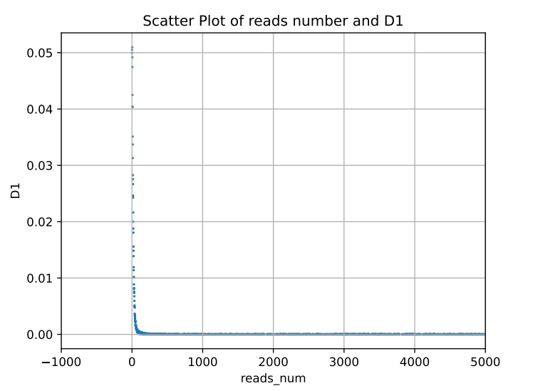
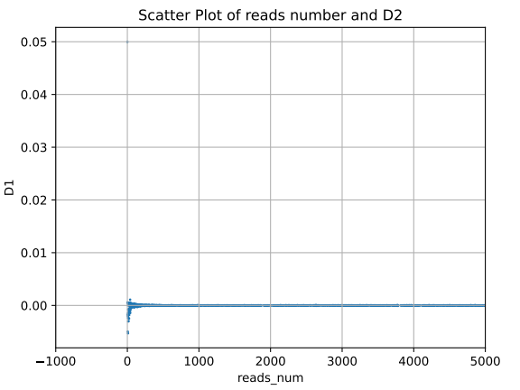
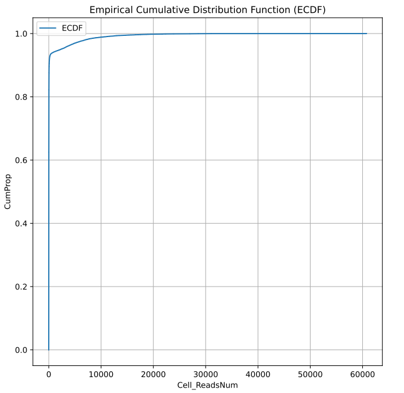
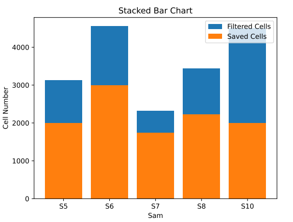

# Step 2. Filter low-quality cells.

## Class：BCFilter(inputfastq,outputdir)
- **类功能：**

根据一个样本中，每个液滴reads条数的累积分布，去除含有过少reads的液滴。

- **必选参数：**
```
inputFastq  --  样本的短reads测序文件位置
                如果是单端fastq文件，文件名必须以.fastq结尾；
                如果是双端fastq文件，文件名必须以_R1.fastq或_R2.fastq结尾，并以列表格式给出。

outputdir   --  所有结果文件的存放路径
```


## Func 1：CellCountStatistic()

- **函数功能：**
统计该inputfastq中每个细胞的reads数。


- **结果：**

Eg. bcread.txt

|    cell    | read  |
|:----------:|:-----:|
| Cell500000 |  332  |
| Cell500001 |  131  |
| Cell500002 | 88281 |
| Cell500003 |  420  |
| Cell500004 | 1593  |
|    ...     |  ...  |


## Func 2：getMinReads()

- **函数功能：**
根据一个样本中细胞reads数目的分布，找出这个样本中去除少reads细胞的min_reads阈值。


## Func 3：BCMinReads()

- **函数功能：**
根据min_reads，过滤细胞(及其inputFastq),得到BC_Count_Filter.txt。


```
#执行代码

import MetaSAG.BCFilter as bcf

obj=bcf.BCFilter('./testData/BCFilter/input/S10_Tag.fastq','./testData/BCFilter/result/')

obj.CellCountStatistic()

# obj.BC_Count  展示每个细胞中有多少条reads的数据框（可修改）

obj.getMinReads()

# obj.min_reads 展示该样本应选取的最低reads阈值（可修改）

obj.BCMinReads()

#obj.BC_Count_Filter    展示根据obj.min_reads过滤后剩余的细胞列表


```







## Func 4：SamsBCFilterStack(Sam,SavedCell,AllCell,outputDir)

- **函数功能：**
多个样本过滤细胞前后细胞数量的统计，绘制堆叠柱状图。

- **必选参数：**
```
Sam       --  样本名列表
AllCell   --  每个样本中所有细胞个数列表
SaveCell  --  过滤细胞后，每个样本中保留的细胞个数列表
outputDir --  结果文件存放路径
```

```
#执行代码示例
AllCell = [3132, 4557, 2321, 3433, 4500]

SavedCell = [2000,3000,1734,2222,2000]

Sam=['S5','S6','S7','S8','S10']

outputDir=’./testData/BCFilter/result/’

import MetaSAG.BCfilter as bcf

bcf.SamBCFilterStack(Sam,SavedCell,AllCell,'./testData/BCFilter/result/')


```


