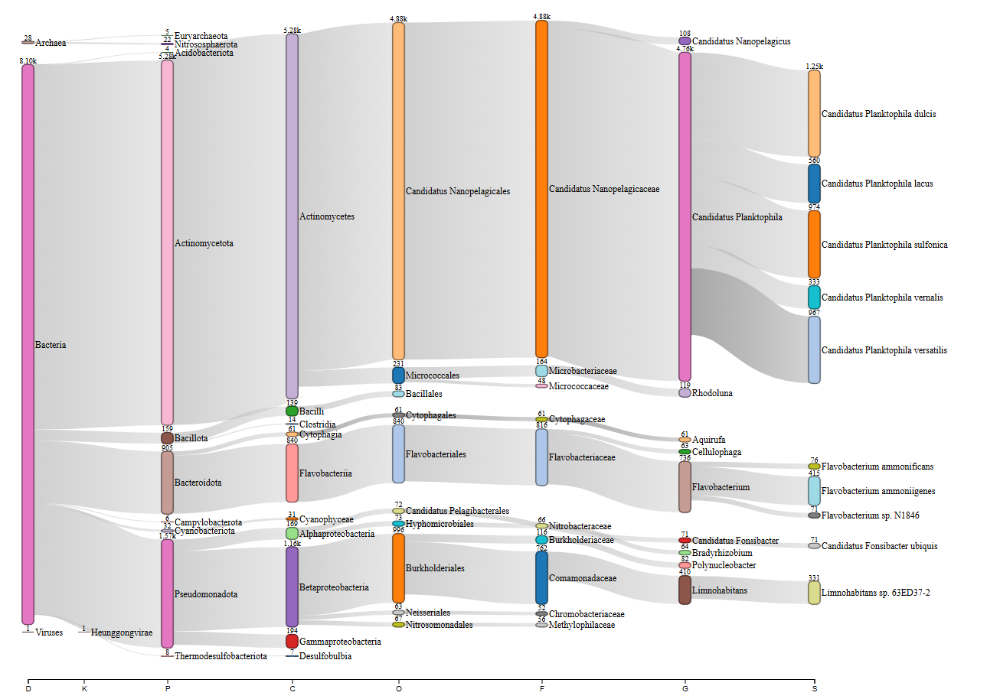

# Step 3. MetaPhlAn4 annotates the reads and classifies droplets

## Func：MPAnno(inputFastq, MPOut, SamName)
- **函数功能：**

调用MetaPhlAnN4,对输入的fastq文件进行注释。

- **必选参数：**
```
inputFastq      --      样本的短reads测序文件位置。
                        如果是单端fastq文件，文件名必须以.fastq结尾；
                        如果是双端fastq文件，文件名必须以_R1.fastq或_R2.fastq结尾，并以列表格式给出。
                        
MPOut           --      MetaPhlAnN4注释结果存放路径。

SamName         --      结果文件名前缀。

```
- **可选参数：**
```
env     --      MetaPhlAnN4软件所在conda环境。
                默认为None。
                
DB      --      MetaPhlAnN4软件参考数据库路径
                默认为None。

```

```
#执行代码示例

from MetaSAG import MetaPhlAnAsign as mpa

#test.fastq 61Mb
inputFastq = './testData/MetaPhlAnAsign/input/test.fastq'

MPOut = './testData/MetaPhlanAsign/result/'

SamName = 'test'

mpa.MPAnno(inputFastq,MPOut,SamName,env='metaphlan4.1',DB='/data_alluser/singleCellMicrobiome/dmy_test/gj/MetaPhIAn4_1/DB_Jun23/')
# MPAnno took 170.1611 seconds to execute.

```
## Class：MPBowtie(inputBowtie,outputDir)
- **类功能：**

对MetaPhlAnN4对短读段的注释结果进行统计,判断液滴的分类情况。

- **必选参数：**
```
inputBowtie     --  输入MetaPhlAnN4注释结果文件。

outputdir       --  所有结果文件的存放路径。
```

## Func 1：CellSGBStatistic()

- **函数功能：**

统计每个细胞中，各MetaPhlAnN4参考数据库中分类的比对count数。

- **结果：**

Eg. Cell_SGB_Count.txt [SGB编号]

|     Cell      |   SGB    | Count |
|:-------------:|:--------:|:-----:|
| Sam0516_10000 | SGB64109 |  190  |
| Sam0516_10000 | SGB64102 |  67   |
| Sam0516_10000 | SGB82226 |   8   |
| Sam0516_10000 | SGB94461 |   9   |
| Sam0516_10000 | SGB30641 |   1   |
| Sam0516_10002 | SGB48813 |  881  |
| Sam0516_10002 | SGB5713  |  16   |
| Sam0516_10002 | SGB82226 |   6   |
|      ...      |   ...    |  ...  |


Eg. Cell_Erro_Count.txt [非SGB编号]

|    Cell     |                   Erro                   | Count |
|:-----------:|:----------------------------------------:|:-----:|
| Cell1000073 | VDB\|002F-00A5-0-0002\|M1102-c76-c0-c51  |   1   |
| Cell1001329 | VDB\|0018-0003-0-0016\|M1102-c72-c0-c223 |   2   |
| Cell1001329 | VDB\|0002-003F-0-0000\|M1102-c76-c0-c89  |   8   |
| Cell1001344 |     EUK34381__GCF_003184785.1_00904      |   1   |
| Cell1001329 | VDB\|0002-003F-0-0000\|M1102-c76-c0-c89  |   8   |
| Cell1020068 | VDB\|001D-010E-0-0001\|M305-c1704-c0-c95 |  30   |
|     ...     |                   ...                    |  ...  |


## Func 2：CellAsign(BC_Count)

- **函数功能：**

结合每个细胞的reads总数，根据阈值将细胞分类为**已知分类细胞，未知分类细胞，多胞液滴，未分类细胞**。

- **必选参数：**
```
BC_Count        --      记录每个细胞中含有的reads计数DataFrame类型对象。
                        要求第一列为细胞ID,第二列为计数。
```````
Eg.

|    cell    | read  |
|:----------:|:-----:|
| Cell500000 |  332  |
| Cell500001 |  131  |
| Cell500002 | 88281 |
| Cell500003 |  420  |
| Cell500004 | 1593  |
|    ...     |  ...  |

- **可选参数：**
```
Min_Reads           --      每个细胞含有reads总数的最小阈值。
                            默认为None。
                            
total_annoreads     --      每个细胞被注释到的reads总数的最小阈值。
                            默认为200。
                            
SGB_rate            --      要求每个细胞被注释分类的最大reads比例
                            默认为0.8。     
                            
Double_SGB_rate     --      多胞液滴中每个分类占总注释reads的最小比例
                            默认为0.2。      
                            
Double_All_rate     --      多胞液滴中，大于Double_SGB_rate的分类比例总和最小阈值。
                            默认为0.8。
                            
Double_Annoreads    --      多胞液滴被注释到reads总数的最小阈值。

Unknown_Allreads    --      未知分类细胞中总reads计数的最小阈值
                            默认为500。
                            
Unknown_Annoreads   --      未知分类细胞中总注释reads技术的最大阈值。
                            默认为10。
                            
SGB_topCell         --      已知分类中，每种分类箱中最可靠细胞个数的最大阈值
                            默认为50。

```

- **结果：**

KnownSGB.txt

DoubleCell.txt

UnKnownSGB.txt

UnAsignedSGB.txt

KnownCellAssem_top50.txt


## Func 3：CellAssem(CellBarn)

- **函数功能：**

根据CellAsign()函数得到的KnownCellAssem_top50.txt,从CellBarn路径下找到相应细胞文件,对每个箱进行组装。


- **必选参数：**
```
CellBarn    --      存放细胞短reads测序文件的路径

```

- **可选参数：**
```
env         --      组装软件(spades.py)需要的conda环境。
                    默认为None

ReadsEnd    --      输入液滴测序文件是单端还是双端
                    默认为单端，ReadsEnd='Single'
                    如果是双端，修改ReadsEnd='Pair'.

```


## Func 4：HostPhage(Group='SGB',cumThresh=0.8 ,MinCellPhage=50)

- **函数功能：**

根据CellAsign()函数得到的Cell_Anno信息,对细胞进行分组统计每组细胞中非SGB读段的计数或比例。

！注意MPBowtie对象的Cell_Anno数据框可以根据用户需要自行更改。

- **可选参数：**
```
Group           --      MPBowtie对象CellAnno信息中对细胞的分组列名称，
                        默认为'SGB'。

cumThresh       --      样本中统计最主流噬菌体的累积分布阈值，
                        默认为0.8。

MinCellPhage    --      认为细胞中显著含有噬菌体的噬菌体reads计数最小阈值，
                        默认为50。
                        
```


Eg. Cell_Anno

|     Cell      |     Type      |   SGB    |
|:-------------:|:-------------:|:--------:|
| Sam0516_10001 |   KnownCell   | SGB64109 |
| Sam0516_10002 |   KnownCell   | SGB48813 |
| Sam0516_1000  |   KnownCell   | SGB64109 |
| Sam0516_1988  |   KnownCell   | SGB28829 |
| Sam0516_5069  |  DoubleCell   |  NoSGB   |
| Sam0516_1164  |  UnknownCell  |  NoSGB   |
| Sam0516_10032 | UnAsignedCell |  NoSGB   |
|      ...      |      ...      |   ...    |


- **结果：**

Eg. MainPhage_Cluster_Count.txt

|                   VDB                    | NoSGB | SGB15318 | SGB1836 | SGB1867 | SGB15326 | SGB1815 | SGB1855  | ... |
|:----------------------------------------:|:-----:|:--------:|:-------:|:-------:|:--------:|:-------:|:--------:|:---:|
| VDB\|0002-003F-0-0000\|M1102-c76-c0-c89  |  35   |    1     |    0    |    0    |    0     |    0    |    0     | ... |
| VDB\|0016-004F-0-0000\|M1102-c76-c0-c195 |  18   |    0     |    0    |    0    |    0     |    0    |    0     | ... |
|  VDB\|0029-0000-0-0001\|M738-c70-c0-c75  |  11   |    1     |    0    |    0    |    0     |    0    |    0     | ... |
| VDB\|0010-00F3-0-0001\|M697-c3861-c6-c0  |   9   |    0     |    6    |    1    |    0     |    0    |    0     | ... |
| VDB\|0046-004E-0-0000\|M282-c3522-c0-c22 |   9   |    0     |    0    |    1    |    0     |    0    |    0     | ... |
| VDB\|0001-00C9-0-0008\|M1102-c79-c0-c41  |   9   |    1     |    0    |    0    |    0     |    0    |    0     | ... |
|                   ...                    |  ...  |   ...    |   ...   |   ...   |   ...    |   ...   |   ...    | ... |


## Func 5：DoubleCellKraken(CellBarn)

- **函数功能：**
根据CellAsign()函数得到的DoubleCell信息,对每个多胞液滴进行Kraken2重注释并绘制单个液滴的物种分类桑基图进行展示。


- **必选参数：**
```
CellBarn    --      存放细胞短reads测序文件的路径

```


- **可选参数：**
```
env         --      Kraken2运行的conda环境。
                    默认为None。
                    
KrakenDB    --      Kraken2参考数据库路径。
                    默认为None。
                    
ReadsEnd    --      输入液滴测序文件是单端还是双端
                    默认为单端，ReadsEnd='Single'
                    如果是双端，修改ReadsEnd='Pair'.
                        
```


- **结果：**




```
#执行代码示例

from MetaSAG import MetaPhlAnAsign as mpa

#MetaPhlAnN4注释

inputFastq = './testData/MetaPhlanAsign/input/test.fastq'

output = './testData/MetaPhlanAsign/result/'

Sam = 'test'

mpa.MPAnno(inputFastq,output,Sam,env='metaphlan4.1',DB='/data_alluser/singleCellMicrobiome/dmy_test/gj/MetaPhIAn4_1/DB_Jun23/')
#MPAnno took 75.6562 seconds to execute.


#构建MPBowtie对象

input_bowtie='/data_alluser/singleCellMicrobiome/dmy_test/gj/MetaPhIAn4_1/PyPack/PyPackData2/testData/MetaPhlAnAsign/input/S10_bowtie2' #497Mb

result_dir='/data_alluser/singleCellMicrobiome/dmy_test/gj/MetaPhIAn4_1/PyPack/PyPackData2/testData/MetaPhlAnAsign/result/'

obj=mpa.MPBowtie(input_bowtie,result_dir) 


#统计细胞注释情况

obj.CellSGBStatistic() 

CellSGBStatistic took 60.7226 seconds to execute.

#查看结果

obj.Cell_SGB_Count

obj.Cell_Erro_Count


#分类细胞(KnownSGB/UnknownCell/DoubleCell/UnAsignedCell)

import pandas as pd

BC_Count=pd.read_csv('./testData/MetaPhlAnAsign/input/S10_bcread.txt',sep='\t',header=0)

obj.CellAsign(BC_Count) 
#CellAsign took 175.5504 seconds to execute.

#查看结果

obj.KnownCell

obj.DoubleCell

obj.UnknownCell

obj.UnAsignedCell

obj.KnownCellAssem

obj.Cell_Anno


#统计噬菌体reads的分布

obj.HostPhage()
#HostPhage took 0.5502 seconds to execute.


#查看多胞液滴物种的分布。

#CellBarn='/data_alluser/singleCellMicrobiome/rawdata_bdwp/202405_standard/all/'

CellBarn='/data_alluser/singleCellMicrobiome/dmy_test/SAGget/S10_real_SAGs/'

obj.DoubleCellKraken(CellBarn,env='kraken',KrakenDB='/data_alluser/public/database/k2_standard_20230605/',ReadsEnd='Single')
# DoubleCellKraken took 3466.3195 seconds to execute.


#根据obj.KnownCellAssem提供的细胞，进行组装
# 1185个Cell

#obj.KnownCellAssem=pd.read_csv('/data_alluser/singleCellMicrobiome/dmy_test/gj/MetaPhIAn4_1/PyPack/PyPackData2/testData/MetaPhlanAsign/result/KnownCellAssemShort.txt',sep='\t',header=0)

#CellBarn='/data_alluser/singleCellMicrobiome/rawdata_bdwp/202405_standard/all/'
CellBarn='/data_alluser/singleCellMicrobiome/dmy_test/SAGget/S10_real_SAGs/'

obj.CellAssem(CellBarn,ReadsEnd='Single')
#CellAssem took 3404.0547 seconds to execute.

```