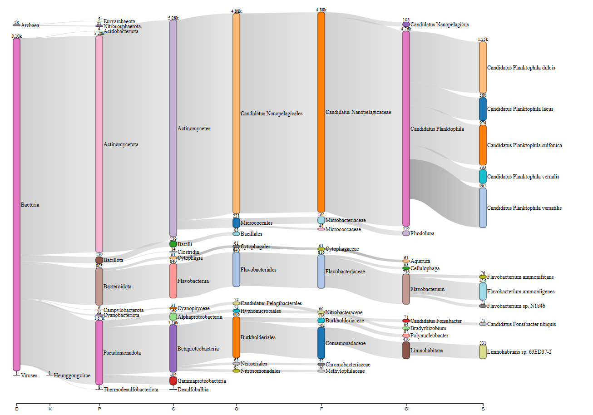

# MetaSAG Usage
## Step 3. MetaPhlAn4 annotates the reads and classifies droplets

## Func：MPAnno(inputFastq, MPOut, SamName)
- **Function Description:**

Executes MetaPhlAn4 to perform microbial community profiling from metagenomic FASTQ files.

- **Required Parameters:**
```
inputFastq      --      Location of short-read sequencing file(s).
                        For single-end FASTQ: Filename must end with .fastq.
                        For paired-end FASTQ: Filenames must end with _R1.fastq and _R2.fastq, provided as a list (e.g., ["sample_R1.fastq", "sample_R2.fastq"]).
                        
MPOut           --      Specifies the output directory path for MetaPhlAn4 taxonomic profiling results.

SamName         --      Output Filename Prefix.

```
- **Optional Parameters:**
```
env     --      Specifies the Conda environment containing the MetaPhlAn4 installation.
                Default Value:None

                
DB      --      MetaPhlAn4 Reference Database Path.
                Default Value:None

```

```python
# Execution Command Examples

from MetaSAG import MetaPhlAnAsign as mpa

SampleName = "Samplename"
Target_Path = "Your/Result/Path/"

inputFastq = [
    Target_Path + "Cell_Filter/Filtered_Fastq/" + SampleName + "_R1.fastq",
    Target_Path + "Cell_Filter/Filtered_Fastq/" + SampleName + "_R2.fastq"
]

MPOut = Target_Path + "MetaPhlAnAsign/annotation_file/"

mpa.MPAnno(inputFastq, MPOut, SampleName, env="metaphlan4.1", DB="/Database/MetaPhIAn4_1/DB_Jun23/")
```
## Class：MPBowtie(inputBowtie,outputDir)
- **Class Function:**

Performs quantitative analysis of MetaPhlAn4 taxonomic profiles to determine microbial taxonomic classification across droplets.

- **Required Parameters:**
```
inputBowtie     --  MetaPhlAn4 annotation results file.

outputdir       --  Specifies the directory path where all output files will be saved.
```

## Func 1：CellSGBStatistic()

- **Function Description:**

Quantifies reference database-aligned read counts for each taxonomic classification at single-cell resolution.

- **Result:**

Eg. Cell_SGB_Count.txt [SGB ID]

|     Cell      |   SGB    | Count |
|:-------------:|:--------:|:-----:|
| Sam0516_10000 | SGB64109 |  190  |
| Sam0516_10000 | SGB64102 |  67   |
| Sam0516_10000 | SGB82226 |   8   |
| Sam0516_10000 | SGB94461 |   9   |
| Sam0516_10000 | SGB30641 |   1   |
| Sam0516_10002 | SGB48813 |  881  |
| Sam0516_10002 | SGB5713  |  16   |
| Sam0516_10002 | SGB82226 |   6   |
|      ...      |   ...    |  ...  |


Eg. Cell_Other_Count.txt [Non-SGB ID]

|    Cell     |                   Other                   | Count |
|:-----------:|:----------------------------------------:|:-----:|
| Cell1000073 | VDB\|002F-00A5-0-0002\|M1102-c76-c0-c51  |   1   |
| Cell1001329 | VDB\|0018-0003-0-0016\|M1102-c72-c0-c223 |   2   |
| Cell1001329 | VDB\|0002-003F-0-0000\|M1102-c76-c0-c89  |   8   |
| Cell1001344 |     EUK34381__GCF_003184785.1_00904      |   1   |
| Cell1001329 | VDB\|0002-003F-0-0000\|M1102-c76-c0-c89  |   8   |
| Cell1020068 | VDB\|001D-010E-0-0001\|M305-c1704-c0-c95 |  30   |
|     ...     |                   ...                    |  ...  |


## Func 2：CellAsign(BC_Count)

- **Function Description:**

Categorizes each cell into four classes **(Known-Taxon Cells,Unknown-Taxon Cells,Multi-cell Droplets,Unclassified Cells)** by integrating total read counts and taxonomic alignment results against predefined thresholds.

- **Required Parameters:**
```
BC_Count        --      Stores per-cell read count statistics in a standardized tabular format for quality control and downstream analysis.
```````
Eg.

|    cell    | read  |
|:----------:|:-----:|
| Cell500000 |  332  |
| Cell500001 |  131  |
| Cell500002 | 88281 |
| Cell500003 |  420  |
| Cell500004 | 1593  |
|    ...     |  ...  |

- **Optional Parameters:**
```
Min_Reads           --      Minimum Total Reads per Cell Threshold.
                            Default Value:None.
                            
total_annoreads     --      Minimum Annotated Reads per Cell Threshold.
                            Default Value:200.
                            
SGB_rate            --      Maximum SGB-Aligned Reads Ratio per Cell.
                            Default Value:0.8. 
                            
Double_SGB_rate     --      The minimum proportion of each SGB classification in the total annotated reads within multi-cell fluid droplets.
                            Default Value:0.2.     
                            
Double_All_rate     --      The minimum threshold for the sum of proportions of SGB classifications greater than Double_SGB_rate in multi-cell fluid droplets.
                            Default Value:0.8.
                            
Double_Annoreads    --      The minimum threshold for the total number of annotated reads in multi-cell fluid droplets.

Unknown_Allreads    --      The minimum threshold for the total read count in unclassified cells.
                            Default Value:500.
                            
Unknown_Annoreads   --      The maximum threshold for the total annotated read count in unclassified cells.
                            Default Value:10.
                            
SGB_topCell         --      The maximum threshold for the number of most reliable cells in each known species taxonomic bin.
                            Default Value:50.

```

- **Result:**

KnownSGB.txt

DoubleCell.txt

UnKnownSGB.txt

UnAsignedSGB.txt

KnownCellAssem_top50.txt


## Func 3：CellAssem(CellBarn)

- **Function Description:**

According to the KnownCellAssem_top50.txt obtained from the CellAsign() function, locate the corresponding cell files from the CellBarn path and assemble them for each bin.

- **Required Parameters:**
```
CellBarn    --      The path where short read sequencing files of cells are stored

```

- **Optional Parameters:**
```
env         --      The name of the conda environment required for the assembly software (spades.py).
                    Default Value:None.

ReadsEnd    --      The type of droplet sequencing files input (single-end or paired-end).
                    The default setting is for single-end reads, with ReadsEnd='Single'. For paired-end reads, modify it to ReadsEnd='Pair'.

phred_offset--      Manually set the sequencing format of the Fastq files used for assembly.
                    Default Value: None.

```

Note on phred_offset:
Normally, the SPAdes assembler automatically detects the quality value format of Fastq files (recent Illumina sequencing data is usually Phred+33). However, when encountering non-standard data that causes SPAdes to fail automatic detection and throw an error, this parameter can be used to forcefully specify the format manually.


## Func 4：HostPhage(Group='SGB',cumThresh=0.8 ,MinCellPhage=50)

- **Function Description:**
Performs group-wise quantification of reads that failed to align to Species-level Genome Bins (SGB) based on cellular annotations from CellAsign(). Generates metrics for unclassified/contaminant sequences at single-cell resolution.
The Cell_Anno data frame of the MPBowtie object can be modified by the user as needed.

- **Optional Parameters:**
```
Group           --      The name of the grouping column for cells in the CellAnno information within the MPBowtie object.
                        Default Value:'SGB'.

cumThresh       --      The cumulative distribution threshold for the most abundant phages in the sample.
                        Default Value:0.8.

MinCellPhage    --      The minimum threshold for phage read counts in cells.
                        Default Value:50。
                        
```


Eg. Cell_Anno

|     Cell      |     Type      |   SGB    |
|:-------------:|:-------------:|:--------:|
| Sam0516_10001 |   KnownCell   | SGB64109 |
| Sam0516_10002 |   KnownCell   | SGB48813 |
| Sam0516_1000  |   KnownCell   | SGB64109 |
| Sam0516_1988  |   KnownCell   | SGB28829 |
| Sam0516_5069  |  DoubleCell   |  NoSGB   |
| Sam0516_1164  |  UnknownCell  |  NoSGB   |
| Sam0516_10032 | UnAsignedCell |  NoSGB   |
|      ...      |      ...      |   ...    |


- **Result**

Eg. MainPhage_Cluster_Count.txt

|                   VDB                    | NoSGB | SGB15318 | SGB1836 | SGB1867 | SGB15326 | SGB1815 | SGB1855  | ... |
|:----------------------------------------:|:-----:|:--------:|:-------:|:-------:|:--------:|:-------:|:--------:|:---:|
| VDB\|0002-003F-0-0000\|M1102-c76-c0-c89  |  35   |    1     |    0    |    0    |    0     |    0    |    0     | ... |
| VDB\|0016-004F-0-0000\|M1102-c76-c0-c195 |  18   |    0     |    0    |    0    |    0     |    0    |    0     | ... |
|  VDB\|0029-0000-0-0001\|M738-c70-c0-c75  |  11   |    1     |    0    |    0    |    0     |    0    |    0     | ... |
| VDB\|0010-00F3-0-0001\|M697-c3861-c6-c0  |   9   |    0     |    6    |    1    |    0     |    0    |    0     | ... |
| VDB\|0046-004E-0-0000\|M282-c3522-c0-c22 |   9   |    0     |    0    |    1    |    0     |    0    |    0     | ... |
| VDB\|0001-00C9-0-0008\|M1102-c79-c0-c41  |   9   |    1     |    0    |    0    |    0     |    0    |    0     | ... |
|                   ...                    |  ...  |   ...    |   ...   |   ...   |   ...    |   ...   |   ...    | ... |


## Func 5：DoubleCellKraken(CellBarn)

- **Function Description:**
According to the DoubleCell information obtained from the CellAsign () function, perform Kraken2 re-annotation on each multi-cell droplet and plot a Sankey diagram of species classification for individual droplets for visualization.

- **Required Parameters:**
```
CellBarn    --      The path to the short-read sequencing files of the cells.

```


- **Optional Parameters:**
```
env         --      The conda environment for running Kraken2.
                    Default: None.
                    
KrakenDB    --      The path to the Kraken2 reference database.
                    Default: None.
                    
ReadsEnd    --      Specifies whether the input droplet sequencing files are single-end or paired-end.
                    Default is single-end, ReadsEnd='Single'.
                    For paired-end, modify to ReadsEnd='Pair'.
                        
```


- **Result:**




```python
# Execution Command Examples

from MetaSAG import MetaPhlAnAsign as mpa
import pandas as pd

SampleName = "Samplename"
Target_Path = "Your/Result/Path/"

# MetaPhlAn4 annotation

inputFastq = Target_Path + "Cell_Filter/Filtered_Fastq/" + SampleName + ".fastq"

output = Target_Path + "MetaPhlAnAsign/annotation_file/"

mpa.MPAnno(inputFastq, output, SampleName, env="metaphlan4.1", DB="/Database/MetaPhIAn4_1/DB_Jun23/")


# Build MPBowtie object

input_bowtie = Target_Path + "MetaPhlAnAsign/annotation_file/" + SampleName + "_bowtie2"

result_dir = Target_Path + "MetaPhlAnAsign/MPAsign/"

obj = mpa.MPBowtie(input_bowtie, result_dir)


# Count SGB and non-SGB alignments for each cell.
obj.CellSGBStatistic()

# Classify cells as KnownCell, UnknownCell, DoubleCell, or UnAsignedCell.
BC_Count = pd.read_csv(Target_Path + "Cell_Filter/bcread.txt", sep="\t", header=0)
obj.CellAsign(BC_Count)

# Summarize non-SGB reads by host or SGB group.

obj.HostPhage()


# View the species distribution of multi-cell droplets.

CellBarn = Target_Path + "Barn/Cell/"

obj.DoubleCellKraken(CellBarn, env="kraken", KrakenDB="/Database/k2_standard_20230605/", ReadsEnd="Single")


# Assemble cells provided by obj.KnownCellAssem


#obj.KnownCellAssem = pd.read_csv( Target_Path + 'MetaPhlAnAsign/MPAsign/KnownCellAssemShort.txt',sep='\t',header=0)

CellBarn = Target_Path + "Barn/Cell/"

obj.CellAssem(CellBarn, ReadsEnd="Single")

```

## Test Data

This step uses the output generated by the Step 1 and Step 2 paired-end tests.

Before running this step, run the Step 1 and Step 2 tests with the same `Target_Path`.

Required input from previous steps:

```text
Target_Path/Cell_Filter/Filtered_Fastq/
├── Test_R1.fastq
└── Test_R2.fastq

Target_Path/Cell_Filter/
└── bcread.txt

Target_Path/Barn/Cell/
├── Cell<TestID><BarcodeIndex>_R1.fastq
└── Cell<TestID><BarcodeIndex>_R2.fastq
```

## Test Usage

```python
from MetaSAG import MetaPhlAnAsign as mpa
import pandas as pd

SampleName = "Test"
Target_Path = "Your/Result/Path/"

inputFastq = [
    Target_Path + "Cell_Filter/Filtered_Fastq/Test_R1.fastq",
    Target_Path + "Cell_Filter/Filtered_Fastq/Test_R2.fastq"
]

MPOut = Target_Path + "MetaPhlAnAsign/annotation_file/"

mpa.MPAnno(inputFastq, MPOut, SampleName, env="metaphlan4.1", DB="/Database/MetaPhIAn4_1/DB_Jun23/")

input_bowtie = Target_Path + "MetaPhlAnAsign/annotation_file/Test_bowtie2"
result_dir = Target_Path + "MetaPhlAnAsign/MPAsign/"

obj = mpa.MPBowtie(input_bowtie, result_dir)
obj.CellSGBStatistic()

BC_Count = pd.read_csv(Target_Path + "Cell_Filter/bcread.txt", sep="\t", header=0)
obj.CellAsign(BC_Count)

obj.HostPhage()

CellBarn = Target_Path + "Barn/Cell/"
obj.DoubleCellKraken(CellBarn, env="kraken", KrakenDB="/Database/k2_standard_20230605/", ReadsEnd="Pair")
obj.CellAssem(CellBarn, ReadsEnd="Pair")
```

## Expected Output

```text
Target_Path/MetaPhlAnAsign/annotation_file/
├── Test_profile.txt
├── Test_bowtie2                         # MetaPhlAn4 Bowtie2 alignment output used by MPBowtie
└── Test_VSC.txt

Target_Path/MetaPhlAnAsign/MPAsign/
├── Cell_SGB.txt
├── Cell_Other.txt
├── Cell_SGB_Count.txt
├── Cell_Other_Count.txt
├── AllCellSummary.txt                   # Per-cell SGB assignment summary
├── KnownSGB.txt                         # Known-taxon cell assignments
├── DoubleCell.txt                       # Multi-cell droplet assignments
├── UnknownSGB.txt                       # Unknown-cell list
├── UnAsignedSGB.txt                     # Unassigned-cell list
├── KnownCellAssem_top50.txt             # Representative cells used for bin assembly
├── CellAnno.txt                         # Key cell annotation file used by downstream analyses
├── HostPhageResult/                     # Host/phage summary results
├── DoubleCellReport/                    # Kraken2 reports for multi-cell droplets
├── BinFastq/                            # SGB-level FASTQ files for assembly
├── BinFasta/                            # Assembled genome FASTA files used by Step 5/6
└── BinFastg/                            # Assembly graph files used by Step 5
```