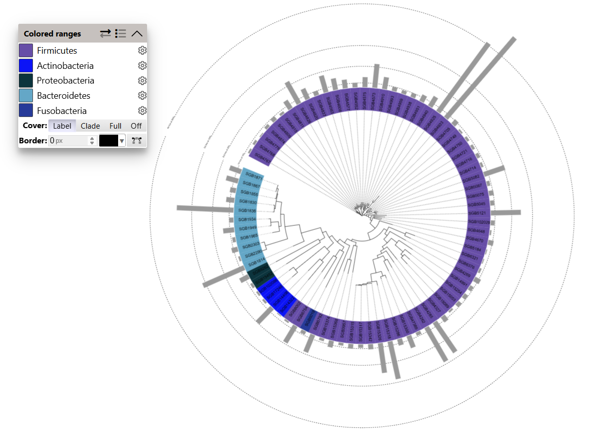

# MetaSAG Usage 
## Step 5. Build phylogenetic tree.


## Func 1：BuildTree(FastaDir,TreeTemp,env=None)

- **Function Description:**

Calls ANVI'O to build a phylogenetic tree for genome files in the input directory.


- **Required Parameters:**
```
FastaDir        --      Path to input genome files (must be an absolute path).

TreeTemp        --      Path to save the tree file results.


```


- **Optional Parameters:**
```
env         --      Conda environment for running ANVI'O.
                    Default: None.
```

- **Result:**

phylogenomic-tree_Bacteria_71_ribosomal6.txt


## Func 2：itolPlot(BinAnno,Anno)

- **Function Description:**

Organizes provided genome information into a data format suitable for plotting phylogenetic trees on the itol web interface.


- **Required Parameters:**
```

BinAnno     --      Information about genome files.

Anno        --      Path to save the itol plotting format results file.


```

Eg. BinAnno (without phylum-level color mapping)

|   Bin   | CellNum |     Phylum     |
|:-------:|:-------:|:--------------:|
| genome1 |   91    |   Firmicutes   |
| genome2 |   44    | Actinobacteria |
| genome3 |   18    | Actinobacteria |
|   ...   |   ...   |      ...       |


Eg. BinAnno (with phylum-level color mapping)

|   Bin   | CellNum |     Phylum     |  Color  |
|:-------:|:-------:|:--------------:|:-------:|
| genome1 |   91    |   Firmicutes   | #705e78 |
| genome2 |   44    | Actinobacteria | #fea443 |
| genome3 |   18    | Actinobacteria | #fea443 |
|   ...   |   ...   |      ...       |   ...   |

- **Result:**




```
# Execution Command Examples

from MetaSAG import Tree as tree

# Build phylogenetic tree

FastaDir='/data_alluser/singleCellMicrobiome/dmy_test/gj/MetaPhIAn4_1/PyPack/PyPackData2/testData/Tree/input' #292Mb

TreeTemp='/data_alluser/singleCellMicrobiome/dmy_test/gj/MetaPhIAn4_1/PyPack/PyPackData2/testData/Tree/result'

tree.BuildTree(FastaDir,TreeTemp,env='anvio-7.1')
#BuildTree took 8312.0662 seconds to execute.


# Prepare itol web tree plotting file

BinAnno='/data_alluser/singleCellMicrobiome/dmy_test/gj/MetaPhIAn4_1/PyPack/PyPackData2/testData/Tree/input/BinAnno'

AnnoResult='/data_alluser/singleCellMicrobiome/dmy_test/gj/MetaPhIAn4_1/PyPack/PyPackData2/testData/Tree/result/Anno'

tree.itolPlot(BinAnno,AnnoResult)


```