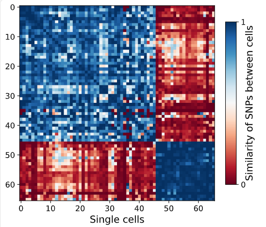
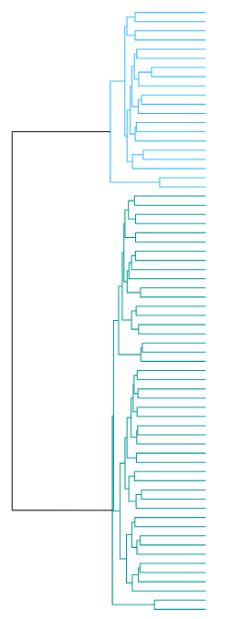
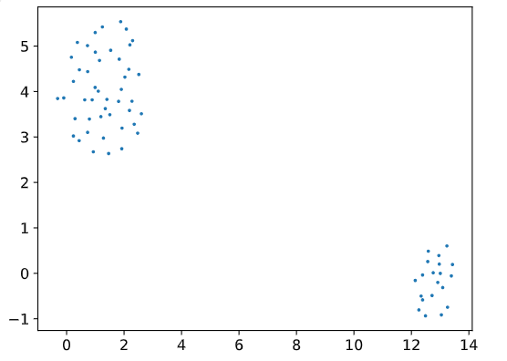
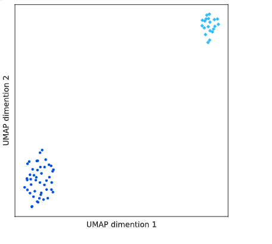

# MetaSAG Usage 
## Step 6. Species to Strain resolved genomes.

## Class1：SingleBin(BinDir, ResultDir, SpeciesName)
- **Class Function:**

Clusters cells within a single species-level bin into strain-level clusters.

- **Required Parameters:**
```
BinDir      --      Path to the species bin directory.
                    The bin must contain fastq sequencing files for each cell and the bin's assembled genome fasta file.    

ResultDir   --      Path to save the strain-clustering results.

SpeciesName --      Name of the bin's assembled genome file (without the .fasta suffix), also serving as the prefix for result filenames.

```

## Func 1：SingleBinPrepare()

- **Function Description:**

Performs variant calling on cells in the input bin and clusters cells based on SNPs, generating visualization plots.

- **Optional Parameters:**

```

bcftools        --      Path to the bcftools executable.
                        Default: None
                        
snap_aligner    --      Path to the snap_aligner executable.
                        Default: None

env             --      Conda environment required for running bcftools/snap_aligner.
                        Default: None

ReadsEnd        --      Type of droplet sequencing reads (single-end or paired-end).
                        Default: single-end, ReadsEnd='Single'.
                        For paired-end, set ReadsEnd='Pair'.

```


- **Results:**






## Func 2：SingleBinSplit(ClusterNum)

- **Function Description:**

Determines the optimal number of clusters for the bin based on visualization results from SingleBinPrepare().

- **Required Parameter:**

ClusterNum      --      Optimal number of clusters for the bin.

- **Results:**




Eg. StrainCell.txt

| Cluster |     Cell      |
|:-------:|:-------------:|
|    0    | Sam1025_10073 |
|    0    | Sam1025_1115  |
|    0    | Sam1025_11610 |
|    1    | Sam1025_11666 |
|    1    | Sam1025_12999 |
|    1    | Sam1025_4770  |
|   ...   |      ...      |


## Func 3：StrainAssem(StrainAssemDir,StrainCellsFile)

- **Function Description:**

Assembles sequencing read sequences for different strains of a bacterial species.

- **Required Parameter:**
```angular2html


StrainAssemDir  --      Assembly result file path(s) for strain sequences.
                        Default: ""

env             --      Conda environment required for running spades.py.
                        Default: None

StrainCellsFile --      Strain information file path for each droplet (StrainCells.txt).
                        Default: ""

```


```

# Execution Command Examples

from MetaSAG import SNPStrain as snp


# Bin preprocessing

# Ensure both FASTA files and cell-specific FASTQ files are located within the same directory for downstream analysis.
BinDir = Target_Path + 'SNPStrain/single_fastqa/SGB6796' #1.5Gb

ResultDir = Target_Path + "SNPStrain/single_result/SGB6796/"

SpeciesName = 'SGB6796'  

SingleBin = snp.SingleBin(BinDir,ResultDir,SpeciesName)

snap_aligner = '/Tools/SNAP/snap-aligner'

bcftools = '/Tools/bcftools/bcftools-1.18/bcftools'

SingleBin.SingleBinPrepare(bcftools=bcftools,snap_aligner=snap_aligner,ReadsEnd='Pair')
#SingleBinPrepare took 216.9003 seconds to execute.

SingleBin.Strain
# Query the number of dropped SNPs/cells

SingleBin.DropSNPNum  # 12057

SingleBin.AllSNPNum  #  22728

SingleBin.AllCellNum  #  69

SingleBin.DropCellNum  #  3


# Clustering
# Determine the number of clusters based on the UMAP plot from SingleBinPrepare()

SingleBin.SingleBinSplit(2)
#SingleBinSplit took 1.2961 seconds to execute.

#Assembling
StrainAssemDir = Target_Path + "SNPStrain/single_result/SGB6796/"
SingleBin.StrainAssem(StrainAssemDir= StrainAssemDir)
```


## Class2：AllBin(FastaDir, FastqDir, CellAnno, ResultDir)
- **Class Function:**

Clusters cells across all species-level bins into strain-level clusters.

- **Required Parameters:**
```
FastaDir        --      Path to the directory containing all bin-assembled genome files.   

FastqDir        --      Path to the directory containing all cell fastq sequencing files.

CellAnno        --      Mapping file between each cell and its corresponding bin.

ResultDir       --      Path to save the bin-clustering results.

```

## Func 1：AllBinPrepare()

- **Function Description:**

Performs variant calling on cells in all input bins and clusters cells based on SNPs, generating visualization plots.

- **Optional Parameters:**
```

bcftools        --      Path to the bcftools executable.
                        Default: None

snap_aligner    --      Path to the snap_aligner executable.
                        Default: None

env             --      Conda environment required for running bcftools/snap_aligner.
                        Default: None

ReadsEnd        --      Type of droplet sequencing reads (single-end or paired-end).
                        Default: single-end, ReadsEnd='Single'.
                        For paired-end, set ReadsEnd='Pair'.

```


Eg. CellAnno.txt

| Cluster  |     Cell      |
|:--------:|:-------------:|
| SGB10068 | Sam1025_10158 |
| SGB10068 | Sam1025_10251 |
| SGB10068 | Sam1025_10392 |
| SGB4577  | Sam1102_7184  |
| SGB4577  | Sam1102_7261  |
|   ...    |      ...      |


## Func 2：AllBinSplit()

- **Function Description:**

Determines the optimal number of clusters for each bin based on visualization results from AllBinPrepare().
Fill in the appropriate cluster numbers for each bin in the ResultDir/BinClusterAnno.txt file (or modify the AllBin object's BinClusterAnno attribute before running the function).

Eg. ResultDir/BinClusterAnno.txt

|         BinPrepareDir          | SpeciesName | ClusterNum |
|:------------------------------:|:-----------:|:----------:|
| ./result/AllBin/SGB10068Result |  SGB10068   |     4      |
| ./result/AllBin/SGB5111Result  |   SGB5111   |     2      |
|              ...               |     ...     |    ...     |


## Func 3：AllBinStrainAssem(StrainAssemDir)

- **Function Description:**

Assembles sequencing read sequences for different strains of each bacterial species.

- **Required Parameter:**
```angular2html

StrainAssemDir  --      Assembly result file path(s) for strain sequences of each species.
                        Default: ""

env             --      Conda environment required for running spades.py.
                        Default: None


```


```
# Execution Command Examples

from MetaSAG import SNPStrain as snp


# Bin preprocessing for all bins

fastaDir = Target_Path  + 'Bin_QC/BinFastaQC2/Pass/'

fastqDir = Target_Path + 'Barn/CellTrim_pair/' # Trimmed single-cell files

cellAnno = Target_Path + 'SNPStrain/All/SNPCluster.txt'

resultDir = Target_Path + 'SNPStrain/All/'

AllBin=snp.AllBin(fastaDir,fastqDir,cellAnno,resultDir)

snap_aligner = 'Tools/SNAP/snap-aligner'

bcftools = 'Tools/bcftools/bcftools-1.18/bcftools'

AllBin.AllBinPrepare(bcftools=bcftools,snap_aligner=snap_aligner,ReadsEnd='Pair')
#AllBinPrepare took 3736.5503 seconds to execute.

# Clustering for all bins
# Note: Before clustering, fill in the appropriate cluster numbers for each bin in ResultDir/BinClusterAnno.txt based on visualization results.

AllBin.AllBinSplit()
#AllBinSplit took 43.4115 seconds to execute

StrainAssemDir = Target_Path + 'SNPStrain/All/Bin/'
AllBin.AllBinStrainAssem(StrainAssemDir = StrainAssemDir)
```