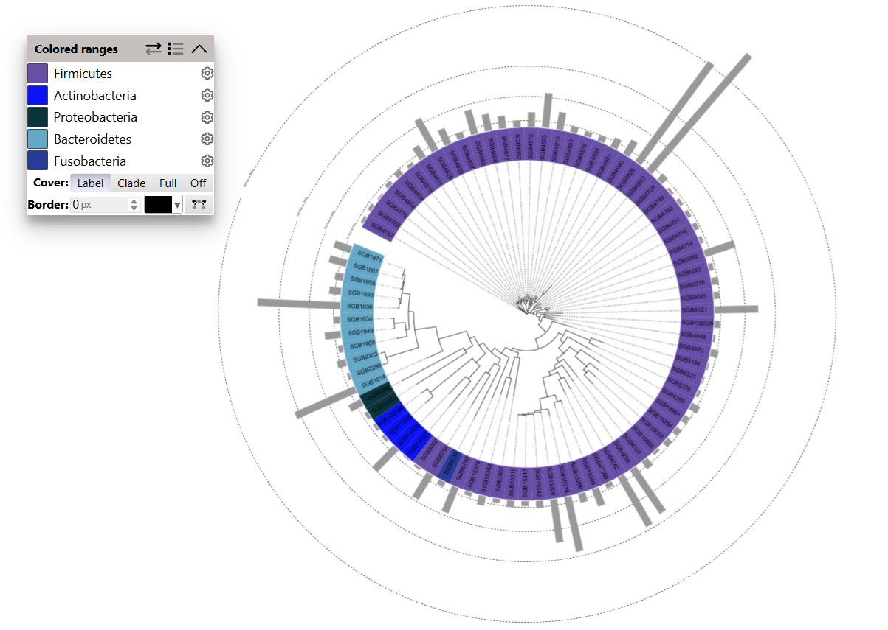

# MetaSAG Usage 
## Step 6. Build phylogenetic tree.


## Func 1：BuildTree(FastaDir,TreeTemp,env=None)

- **Function Description:**

Calls ANVI'O to build a phylogenetic tree for genome files in the input directory.


- **Required Parameters:**
```
FastaDir        --      Path to input genome files (must be an absolute path).

TreeTemp        --      Path to save the tree file results.
```


- **Optional Parameters:**
```
env         --      Conda environment for running ANVI'O.
                    Default: None.
```

- **Result:**

phylogenomic-tree_Bacteria_71_ribosomal6.txt


## Func 2：itolPlot(BinAnno,Anno)

- **Function Description:**

Organizes provided genome information into a data format suitable for plotting phylogenetic trees on the itol web interface.


- **Required Parameters:**
```
BinAnno     --      Information about genome files.

Anno        --      Path to save the itol plotting format results file.
```

Eg. BinAnno (without phylum-level color mapping)

|   Bin   | CellNum |     Phylum     |
|:-------:|:-------:|:--------------:|
| genome1 |   91    |   Firmicutes   |
| genome2 |   44    | Actinobacteria |
| genome3 |   18    | Actinobacteria |
|   ...   |   ...   |      ...       |


Eg. BinAnno (with phylum-level color mapping)

|   Bin   | CellNum |     Phylum     |  Color  |
|:-------:|:-------:|:--------------:|:-------:|
| genome1 |   91    |   Firmicutes   | #705e78 |
| genome2 |   44    | Actinobacteria | #fea443 |
| genome3 |   18    | Actinobacteria | #fea443 |
|   ...   |   ...   |      ...       |   ...   |

- **Result:**



## Func 3：GenerateBinAnno(fasta_dir, cell_anno_file, summary_file, output_file)

- **Function Description:**

This function automatically generates the final bin annotation file to prepare for downstream phylogenetic tree construction by seamlessly aggregating cell annotations and quality control summaries from the executed upstream pipeline modules (MetaSAG_MetaPhlAnAsign and MetaSAG_BinQCAnno).


- **Required Parameters:**
```
fasta_dir       --      The directory containing the FASTA files used for phylogenetic tree construction.

cell_anno_file  --      The path to the `CellAnno.txt` file generated in the `MetaSAG_MetaPhlAnAsign` step. 

summary_file    --      The path to the `summary.txt` file generated in the `MetaSAG_BinQCAnno` step. 
                        
output_file     --      The full output path and filename designated for the resulting `BinAnno.txt` data table. 
```


```bash
# Execution Command Examples

from MetaSAG import Tree as tree

# Generate BinAnno file

FastaDir = Target_Path + 'Bin_QC/Pass/'

CellAnno = Target_Path + 'MetaPhlAnAsign/MPAsign/CellAnno.txt'

Summary = Target_Path + 'Bin_QC/summary.txt'

BinAnno = Target_Path + 'Tree/BinAnno.txt'

tree.GenerateBinAnno(FastaDir, CellAnno, Summary, BinAnno)


# Build phylogenetic tree

FastaDir = Target_Path + 'Bin_QC/Pass/' 

TreeTemp = Target_Path + 'Tree/TreeTemp/'

tree.BuildTree(FastaDir,TreeTemp,env='anvio-7.1')


# Prepare itol web tree plotting file

BinAnno = Target_Path + 'Tree/BinAnno.txt' # Users may either manually create the BinAnno.txt file according to the specifications above or generate it automatically using the GenerateBinAnno function.

AnnoResult = Target_Path + 'Tree/AnnoResult'

tree.itolPlot(BinAnno,AnnoResult)


```

## Test Data

- [`Step_6_8_TestData`](../Example_data/Step_6_8_TestData)

This is a new test dataset for Step 6 and Step 8.

The assembled genomes generated by the previous small test dataset are not sufficient to support phylogenetic tree construction or inter-species horizontal gene transfer analysis. Therefore, Step 6 and Step 8 use this independent test dataset to test the corresponding functions.

The test data include:

```text
Step_6_8_TestData/
├── SGB1814.fasta
├── SGB1949.fasta
├── SGB4327.fasta
├── SGB4768.fasta
├── SGB4874.fasta
├── CellAnno.txt
└── summary.txt
```

## Test Usage

```python
from MetaSAG import Tree as tree

Target_Path = "Your/Result/Path/"
TestData = "../Example_data/Step_6_8_TestData/"

FastaDir = TestData
CellAnno = TestData + "CellAnno.txt"
Summary = TestData + "summary.txt"

BinAnno = Target_Path + "Tree/BinAnno.txt"
TreeTemp = Target_Path + "Tree/TreeTemp/"
AnnoResult = Target_Path + "Tree/AnnoResult/"

tree.GenerateBinAnno(FastaDir, CellAnno, Summary, BinAnno)
tree.BuildTree(FastaDir, TreeTemp, env="anvio-7.1")
tree.itolPlot(BinAnno, AnnoResult)
```

## Expected Output

```text
Target_Path/Tree/
├── BinAnno.txt                                      # Used by Step 8 HGT analysis
├── TreeTemp/
│   ├── FastaAdjust/
│   ├── DB/
│   ├── Anno/
│   ├── external_genomes.txt
│   ├── concatenated-proteins_Bacteria_71_ribosomal6.fa
│   └── phylogenomic-tree_Bacteria_71_ribosomal6.txt # Phylogenetic tree file
└── AnnoResult/
    ├── Label_Anno.txt
    └── Bar_Anno.txt
```

The following files are used in the next step:

```text
# Tree annotation file used by Step 8
Target_Path/Tree/BinAnno.txt

# Phylogenetic tree file used with Step 8 HGT annotation files in iTOL
Target_Path/Tree/TreeTemp/phylogenomic-tree_Bacteria_71_ribosomal6.txt
```
