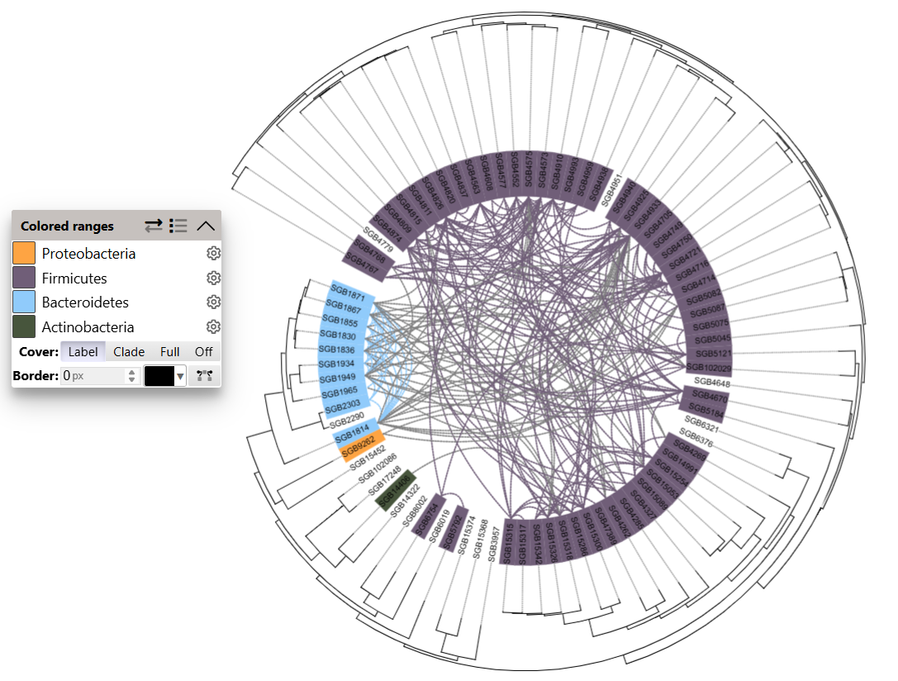

# MetaSAG Usage 
## Step 7. Horizontal Gene Transfer.

## Class：CellHGT(FastaDir,outputDir)
- **Class Function:**

Identify horizontal gene transfer (HGT) between pairwise genome files (species-level).

- **Required Parameters:**
```
FastaDir        --      Path to input genome files.

outputDir       --      Path to save results.

```

## Func 1：SpeciesHGT()

- **Function Description:**
Calculate HGT between pairwise genome files (species-level) and return an HGT.fasta file.
Requirement: Genome files in FastaDir must be named as SpeciesName.fasta (or SpeciesID.fasta), with no underscores allowed.


Eg. HGT.fasta

```

>PAIR_Species1_ContigIDTOSpecies2_ContigID
CCACCATGTATGACTGGCTTGCCACGATT...
>PAIR_SGB4910_36TOSGB15286_37
GTCTATTGATGAGCAAGGACTGAGCAGTG...
...

```


## Func 2：HGTSpeciesPlot(TreeAnno)

- **Function Description:**

Organize provided tree node information into a data format suitable for plotting phylogenetic trees on the itol web interface.

Eg. TreeAnno

|   File    | SpeciesID |     Phylum     | Phylum_Color |
|:---------:|:---------:|:--------------:|:------------:|
| SGB15452  | SGB15452  | Proteobacteria |   #fea443    |
|  SGB9262  |  SGB9262  | Proteobacteria |   #fea443    |
|  SGB6019  |  SGB6019  |  Fusobacteria  |   #b46b6b    |
| SGB102029 | SGB102029 |   Firmicutes   |   #705E78    |
| SGB14991  | SGB14991  |   Firmicutes   |   #705E78    |
|    ...    |    ...    |      ...       |     ...      |





## Func 3：HGTSpeciesAnno(TreeAnno)

- **Function Description:**

Annotate genes in the HGT.fasta file, cluster them by similarity, and statistically analyze the species involved in each gene cluster.

- **Required Parameter:**
```
TreeAnno        --      Tree node annotation file.

```

- **Optional Parameters:**

```
prokka_env      --      Conda environment for Prokka.
                        Default: None

cdhit_env       --      Conda environment for CD-HIT.
                        Default: None

emapper_env     --      Conda environment for Eggnog-mapper.
                        Default: None

emapper_DB      --      Path to the Eggnog-mapper reference database.
                        Default: None

```


- **Results:**

Eg. ./SpeciesHGTResult/HGTSpeciesAnno/AnnoCDHit/CDHitCluster.txt

|  Cluster  |      Gene      |           Contig            |  Bin1   |  Bin2   |
|:---------:|:--------------:|:---------------------------:|:-------:|:-------:|
| Cluster 0 | HDNNIBCP_01849 |  PAIR_SGB4573_3TOSGB4826_1  | SGB4573 | SGB4826 |
| Cluster 0 | HDNNIBCP_02231 | PAIR_SGB4573_3TOSGB4874_121 | SGB4573 | SGB4874 |
| Cluster 1 | HDNNIBCP_04222 | PAIR_SGB4874_121TOSGB4826_1 | SGB4874 | SGB4826 |
|    ...    |      ...       |             ...             |   ...   |   ...   |


Eg. ./SpeciesHGTResult/HGTSpeciesAnno/AnnoCDHit/ClusterBin.txt

|  Cluster  |         Binlist         |
|:---------:|:-----------------------:|
| Cluster 0 | SGB4874,SGB4573,SGB4826 |
| Cluster 1 |     SGB4874,SGB4826     |
|    ...    |           ...           |


## Func 4：StrainHGT()

- **Function Description:**

Calculate HGT between pairwise genome files (strain-level) and return an HGT.fasta file.
Requirement: Genome files in FastaDir must be named as SpeciesName@StrainID.fasta (or SpeciesID@StrainID.fasta), with no underscores allowed.

Eg. HGT.fasta

```

>PAIR_Species1@Strain2_ContigIDTOSpecies2@Strain0_ContigID
CCACCATGTATGACTGGCTTGCCACGATT...
>PAIR_yw14@strain0_24TOyw90@strain0_14
GGTTCTTGTAGTTGTGGGCCTCGTCCACAAACAGCCGGT
...

```


## Func 5：HGTStrainAnno(TreeAnno)

- **Function Description:**

Annotate genes in the HGT.fasta file, cluster them by similarity, and statistically analyze the strains involved in each gene cluster.

- **Required Parameter:**
```
TreeAnno        --      Tree node annotation file.

```

- **Optional Parameters:**

```
prokka_env      --      Conda environment for Prokka.
                        Default: None

cdhit_env       --      Conda environment for CD-HIT.
                        Default: None

emapper_env     --      Conda environment for Eggnog-mapper.
                        Default: None

emapper_DB      --      Path to the Eggnog-mapper reference database.
                        Default: None

```


```
# Execution Command Examples

from MetaSAG import CellHGT as hgt


# Identify horizontal gene transfer sequences between pairwise genomes (species-level) and generate HGT.fasta

fastaDir = Target_Path + 'Bin_QC/BinFastaQC2/Pass/' #292Mb

HGTTemp = Target_Path + 'HGT/Species/'


obj=hgt.CellHGT(fastaDir,HGTTemp)

obj.SpeciesHGT()
#SpeciesHGT took 5402.5489 seconds to execute.


## Prepare plotting annotation files for the itol web interface

TreeAnno = Target_Path + 'HGT/Species/TreeAnno.txt'

obj.HGTSpeciesPlot(TreeAnno)
# HGTSpeciesPlot took 0.0513 seconds to execute.

# Annotate HGT contigs, cluster by similarity, and perform statistical analysis

obj.HGTSpeciesAnno(TreeAnno,prokka_env='prokka',cdhit_env='base',emapper_env='eggnog-mapper2',emapper_DB='/Database/eggnogDB/')
# HGTSpeciesAnno took 433.1531 seconds to execute.

```


