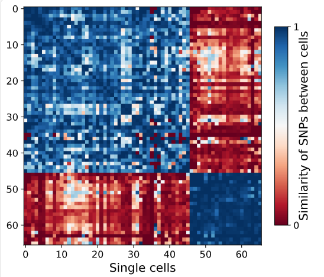
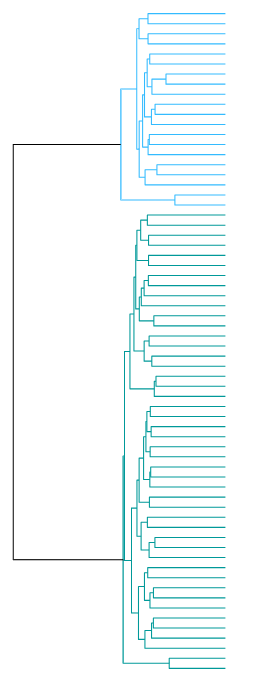
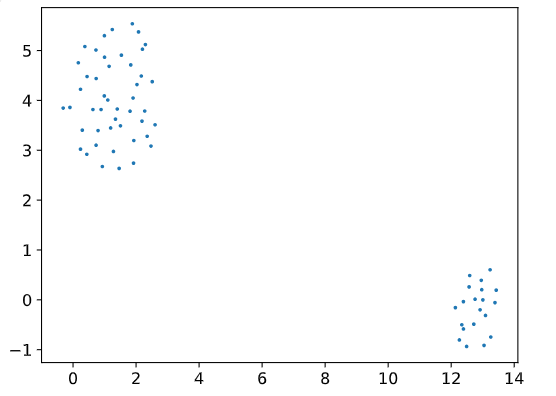
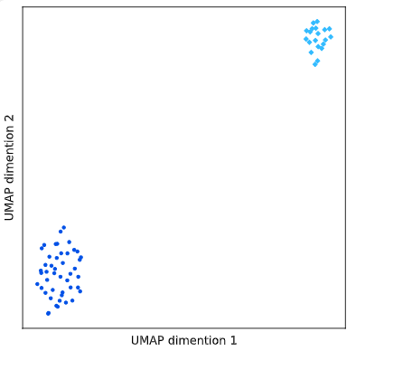

# MetaSAG Usage 
## Step 7. Species to Strain resolved genomes.

## Class1：SingleBin(BinDir, ResultDir, SpeciesName)
- **Class Function:**

Clusters cells within a single species-level bin into strain-level clusters.

- **Required Parameters:**
```
BinDir      --      Path to the species bin directory.
                    The bin must contain fastq sequencing files for each cell and the bin's assembled genome fasta file.    

ResultDir   --      Path to save the strain-clustering results.

SpeciesName --      Name of the bin's assembled genome file (without the .fasta suffix), also serving as the prefix for result filenames.

```

## Func 1：SingleBinPrepare()

- **Function Description:**

Performs variant calling, SNP-based cell clustering, and plotting. For BAM sorting, two methods are available: SAMtools and SNAP. SAMtools is used by default and is recommended for stable full analysis. SNAP sorting is faster and suitable for rapid preliminary analysis, but it may fail for some bins; bins with SNAP sorting failure should be re-run with SAMtools sorting.

- **Optional Parameters:**

```

bcftools        --      Path to the bcftools executable.
                        Default: None
                        
snap_aligner    --      Path to the snap_aligner executable.
                        Default: None

samtools        --      Path to the SAMtools executable.
                        Default: None

env             --      Conda environment required for running bcftools/snap_aligner.
                        Default: None

ReadsEnd        --      Type of droplet sequencing reads (single-end or paired-end).
                        Default: single-end, ReadsEnd='Single'.
                        For paired-end, set ReadsEnd='Pair'.

min_cells        --     The minimum number of cells remaining after filtering. 
                        Default: 5.

sort_tool        --     Select the software used for sorting BAM files.
                        Default: SAMtools, sort_tool='samtools', recommended for stable full analysis.
                        For SNAP internal sorting, set sort_tool='snap'. SNAP is faster but may produce SNAP_SORT_FAILED or QC_FAILED for some bins.
                        Passed_Cells may differ between SAMtools and SNAP sorting because the BAM sorting and output methods are different.
```


- **Results:**






## Func 2：SingleBinSplit(ClusterNum)

- **Function Description:**

Determines the optimal number of clusters for the bin based on visualization results from SingleBinPrepare().

- **Required Parameter:**

ClusterNum      --      Optimal number of clusters for the bin.

- **Results:**




Eg. StrainCell.txt

| Cluster |     Cell      |
|:-------:|:-------------:|
|    0    | Sam1025_10073 |
|    0    | Sam1025_1115  |
|    0    | Sam1025_11610 |
|    1    | Sam1025_11666 |
|    1    | Sam1025_12999 |
|    1    | Sam1025_4770  |
|   ...   |      ...      |


## Func 3：StrainAssem(StrainAssemDir,ReadsEnd)

- **Function Description:**

Assembles sequencing read sequences for different strains of a bacterial species.

- **Required Parameters:**
```
StrainAssemDir  --      Assembly result file path for strain sequences.

ReadsEnd        --      Type of droplet sequencing reads (single-end or paired-end).
```


- **Optional Parameters:**
```
env             --      Conda environment required for running spades.py.
                        Default: None

StrainCellsFile --      Path to the cell strain classification file.
                        Default: None. 
                        If not specified, the program will automatically inherit and use the file generated by the previous upstream function.
```

## Func 4：SetupRunDir(fastaDir, fastqDir, cellAnno, ReadsEnd)

- **Function Description:**

This function fully automates the construction of an independent working directory for single-species strain splitting by deeply integrating with data from previous pipeline steps. Specifically, it utilizes the upstream annotation file (CellAnno) to extract all cell information associated with the target species (SpeciesName) within the SingleBin class, automatically generating a dedicated, isolated BinDir working directory under the ResultDir path.

- **Required Parameters:**
```
fastaDir        --      The directory containing the FASTA files intended for SNP-based strain splitting.

fastqDir        --      The directory containing the individual FASTQ files for each cell.

cellAnno        --      The path to the `CellAnno.txt` file generated in the upstream `MetaSAG_MetaPhlAnAsign` step. 
```           

- **Optional Parameters:**
```
ReadsEnd        --      Type of droplet sequencing reads (single-end or paired-end).
                        Default: 'Single'. For paired-end reads, set ReadsEnd='Pair'.
```


```bash
# Execution Command Examples

from MetaSAG import SNPStrain as snp


# Bin preprocessing

# Ensure both FASTA files and cell-specific FASTQ files are located within the same directory for downstream analysis.

BinDir = Target_Path + 'SNPStrain/single_fastqa/SGB6796' 

ResultDir = Target_Path + "SNPStrain/single_result/SGB6796/"

SpeciesName = 'SGB6796'  

SingleBin = snp.SingleBin(BinDir,ResultDir,SpeciesName)

fastaDir = Target_Path + 'Bin_QC/PASS/'

fastqDir = fastqDir = Target_Path + 'CellBarn/'

cellAnno = Target_Path + 'MetaPhlAnAsign/MPAsign/CellAnno.txt'

SingleBin.SetupRunDir( fastaDir , fastqDir , cellAnno , "Pair")

snap_aligner = '/Tools/SNAP/snap-aligner'

bcftools = '/Tools/bcftools/bcftools-1.18/bcftools'

SingleBin.SingleBinPrepare(bcftools=bcftools,snap_aligner=snap_aligner,ReadsEnd='Pair')


SingleBin.Strain
# Query the number of dropped SNPs/cells

SingleBin.DropSNPNum  # 12057

SingleBin.AllSNPNum  #  22728

SingleBin.AllCellNum  #  69

SingleBin.DropCellNum  #  3


# Clustering
# Determine the number of clusters based on the UMAP plot from SingleBinPrepare()

SingleBin = snp.SingleBin(BinDir,ResultDir,SpeciesName)

SingleBin.SingleBinSplit(2)


#Assembling

StrainAssemDir = Target_Path + "SNPStrain/single_result/SGB6796/"

SingleBin.StrainAssem(StrainAssemDir= StrainAssemDir, ReadsEnd='Pair')
```


## Class2：AllBin(FastaDir, FastqDir, CellAnno, ResultDir)
- **Class Function:**

Clusters cells across all species-level bins into strain-level clusters.

- **Required Parameters:**
```
FastaDir        --      Path to the directory containing all bin-assembled genome files.   

FastqDir        --      Path to the directory containing all cell fastq sequencing files.

CellAnno        --      Mapping file between each cell and its corresponding bin.

ResultDir       --      Path to save the bin-clustering results.
```

## Func 1：AllBinPrepare()

- **Function Description:**

Performs variant calling on cells in all input bins and clusters cells based on SNPs, generating visualization plots. For BAM sorting, SAMtools is used by default and is recommended for stable full analysis. SNAP sorting is faster and suitable for rapid preliminary analysis, but bins with SNAP sorting failure should be re-run with SAMtools sorting.

- **Optional Parameters:**
```

bcftools        --      Path to the bcftools executable.
                        Default: None

snap_aligner    --      Path to the snap_aligner executable.
                        Default: None

samtools        --      Path to the SAMtools executable.
                        Default: None

env             --      Conda environment required for running bcftools/snap_aligner.
                        Default: None

ReadsEnd        --      Type of droplet sequencing reads (single-end or paired-end).
                        Default: single-end, ReadsEnd='Single'.
                        For paired-end, set ReadsEnd='Pair'.

exclude_clusters--      Specifies groups or bins to be excluded from the analysis (e.g., 'NoSGB'). 
                        Accepts either a single string or a list of strings.
                        Default: None.     

min_cells       --      The minimum number of cells remaining after filtering. 
                        Default: 5.

sort_tool       --      Select the software used for sorting BAM files.
                        Default: SAMtools, sort_tool='samtools', recommended for stable full analysis.
                        For SNAP internal sorting, set sort_tool='snap'. SNAP is faster but may produce SNAP_SORT_FAILED or QC_FAILED for some bins.
                        Passed_Cells may differ between SAMtools and SNAP sorting because the BAM sorting and output methods are different.

```


Eg. CellAnno.txt

| Cluster  |     Cell      |
|:--------:|:-------------:|
| SGB10068 | Sam1025_10158 |
| SGB10068 | Sam1025_10251 |
| SGB10068 | Sam1025_10392 |
| SGB4577  | Sam1102_7184  |
| SGB4577  | Sam1102_7261  |
|   ...    |      ...      |


## Func 2：AllBinSplit()

- **Function Description:**

Determines the optimal number of clusters for each bin based on visualization results from AllBinPrepare().
Fill in the appropriate cluster numbers for each bin in the ResultDir/BinClusterAnno.txt file (or modify the AllBin object's BinClusterAnno attribute before running the function).

Eg. ResultDir/BinClusterAnno.txt

|         BinPrepareDir          | SpeciesName | ClusterNum |
|:------------------------------:|:-----------:|:----------:|
| ./result/AllBin/SGB10068Result |  SGB10068   |     4      |
| ./result/AllBin/SGB5111Result  |   SGB5111   |     2      |
|              ...               |     ...     |    ...     |


## Func 3：AllBinStrainAssem(StrainAssemDir)

- **Function Description:**

Assembles sequencing read sequences for different strains of each bacterial species.

- **Required Parameters:**
```
StrainAssemDir  --      Assembly result file path for strain sequences. 
```
- **Optional Parameters:**
```
env             --      Conda environment required for running spades.py.
                        Default: None

ReadsEnd        --      Type of droplet sequencing reads (single-end or paired-end).
                        Default: single-end, ReadsEnd='Single'.
                        For paired-end, set ReadsEnd='Pair'.
```
Eg.Strain_Analysis_Summary.csv

| SpeciesName |      Status      | Passed_Cells |
|:-----------:|:----------------:|:------------:|
|   SGB4584   |     SUCCESS      |      69      |
|   SGB6754   |     SUCCESS      |      25      |
|   SGB4540   |     SUCCESS      |      30      |
|   SGB4940   |    QC_FAILED     |      0       |
|   SGB4577   |     SUCCESS      |      16      |
|   SGB4834   |     NO_FASTA     |      0       |
|   SGB6796   | SNAP_SORT_FAILED |      0       |

Status descriptions:

- `SUCCESS`: Analysis completed successfully under the current sorting method.
- `QC_FAILED`: Downstream SNP or cell filtering did not pass QC under the current sorting method.
- `SNAP_SORT_FAILED`: SNAP internal `-so` sorting failed; re-running this bin with SAMtools sorting is recommended.
- `NO_FASTA`: The corresponding FASTA file is missing.

Note: `QC_FAILED` does not mean that the bin fails under all sorting methods. It only indicates QC failure under the current sorting method. Because SAMtools sorting and SNAP internal `-so` sorting generate BAM output differently, downstream SNP filtering and `Passed_Cells` may differ between the two methods.

```bash
# Execution Command Examples

from MetaSAG import SNPStrain as snp


# Bin preprocessing for all bins

fastaDir = Target_Path  + 'Bin_QC/Pass/'

fastqDir = Target_Path + 'Barn/CellTrim_pair/' # Trimmed single-cell files

cellAnno = Target_Path + 'SNPStrain/All/SNPCluster.txt'

resultDir = Target_Path + 'SNPStrain/All/'

AllBin=snp.AllBin(fastaDir,fastqDir,cellAnno,resultDir)

snap_aligner = 'Tools/SNAP/snap-aligner'

bcftools = 'Tools/bcftools/bcftools-1.18/bcftools'

AllBin.AllBinPrepare(bcftools=bcftools,snap_aligner=snap_aligner,ReadsEnd='Pair',exclude_clusters='NoSGB')

# Clustering for all bins
# Note: Before clustering, fill in the appropriate cluster numbers for each bin in ResultDir/BinClusterAnno.txt based on visualization results.

AllBin = snp.AllBin(fastaDir,fastqDir,cellAnno,resultDir)

AllBin.AllBinSplit()

StrainAssemDir = Target_Path + 'SNPStrain/All/Bin/'

AllBin.AllBinStrainAssem(StrainAssemDir = StrainAssemDir , ReadsEnd='Pair')
```

## Test Data

- [`Step_7_TestData`](../Example_data/Step_7_TestData)

The Step 1–5 small test dataset is mainly used to verify that the workflow can run. Because the assembled genomes and cell data generated from that small test dataset are not sufficient to support reliable strain splitting, Step 7 uses this independent test dataset for strain-level analysis.

The test data include one species-level bin and its single-cell FASTQ files:

```text
Step_7_TestData/
├── SGB8002.fasta
├── CellAnno.txt
├── Cell3311830.fastq
├── Cell1402707.fastq
├── Cell3323424.fastq
├── Cell1432856.fastq
└── ...
```

## Test Usage

This test runs the single-bin strain splitting workflow for `SGB8002` using single-end cell FASTQ files.

```python
from MetaSAG import SNPStrain as snp

Target_Path = "Your/Result/Path/"
TestData = "../Example_data/Step_7_TestData/"

SpeciesName = "SGB8002"
BinDir = Target_Path + "SNPStrain/SingleBin/SGB8002/"
ResultDir = Target_Path + "SNPStrain/SingleBin/SGB8002_Result/"

SingleBin = snp.SingleBin(BinDir, ResultDir, SpeciesName)

fastaDir = TestData
fastqDir = TestData
cellAnno = TestData + "CellAnno.txt"

SingleBin.SetupRunDir(fastaDir, fastqDir, cellAnno, ReadsEnd="Single")

snap_aligner = "/Tools/SNAP/snap-aligner"
bcftools = "/Tools/bcftools/bcftools-1.18/bcftools"
samtools = "samtools"

SingleBin.SingleBinPrepare(
    bcftools=bcftools,
    snap_aligner=snap_aligner,
    samtools=samtools,
    ReadsEnd="Single",
    sort_tool="samtools"
)

# Determine the cluster number based on the UMAP and tree plots generated by SingleBinPrepare().
SingleBin.SingleBinSplit(2)

StrainAssemDir = Target_Path + "SNPStrain/SingleBin/StrainAssem/"
SingleBin.StrainAssem(StrainAssemDir=StrainAssemDir, ReadsEnd="Single")
```

## Expected Output

Only the key result files are shown below:

```text
Target_Path/SNPStrain/SingleBin/
├── SGB8002/                              # Runtime directory with linked FASTA and cell FASTQ files
├── SGB8002_Result/
│   ├── ResultBam/
│   ├── ResultVCF/
│   │   ├── SGB8002_calls_snps_qual30.vcf
│   │   ├── SGB8002_calls_snps_qual30.vcf_snp_filtered_bc_dropped.csv
│   │   └── snp_pd.pkl
│   ├── ResultPic/
│   │   ├── SGB8002sp_call_SNP_similarity_tree.svg    # Visualization: SNP-based phylogenetic tree
│   │   ├── SGB8002sp_call_SNP_similarity.svg         # Visualization: SNP similarity heatmap
│   │   ├── SGB8002sp_call_SNP_umap.svg               # Visualization: preliminary UMAP clustering plot
│   │   └── SGB8002_sp_call_SNP_umap_final.svg        # Visualization: final strain clustering plot
│   └── StrainCells.txt                   # Key strain assignment file for cells
└── StrainAssem/
    └── SGB8002_StrainAssem/
        ├── SGB8002@0.fasta
        └── SGB8002@1.fasta
```

`StrainCells.txt` records the strain cluster assigned to each cell. The final `SGB8002@<cluster>.fasta` files can be used for downstream strain-level analyses.
