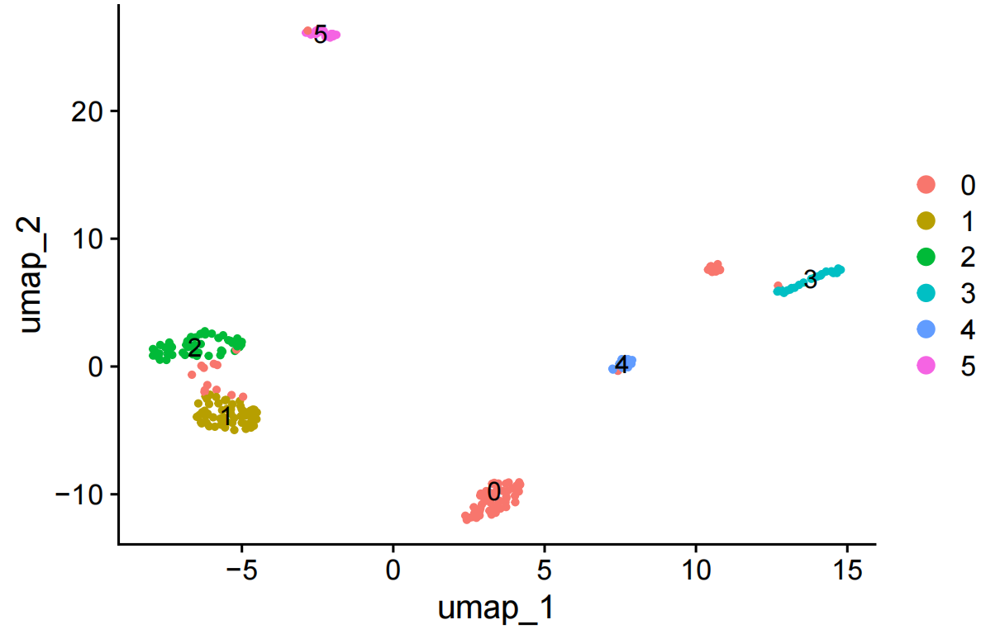
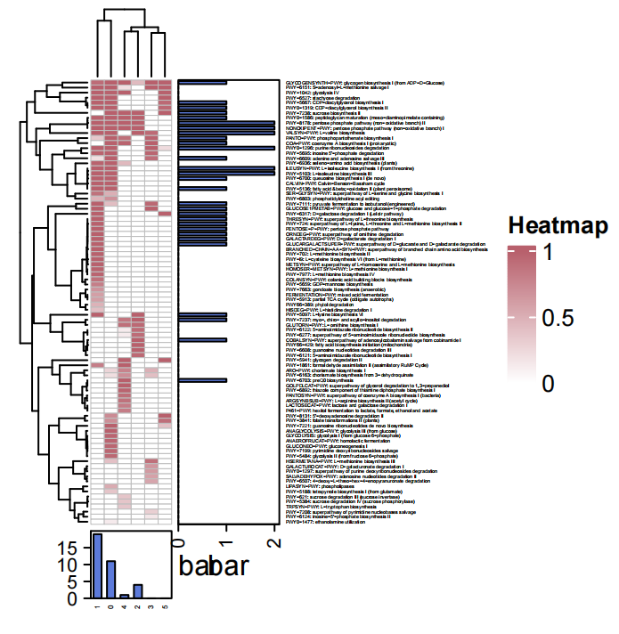

# MetaSAG Usage 
## Step 8. HUMAnN Path.

## Class：HP(FastqDir,ResultDir)
- **类功能：**

对所有测序读段根据分类，调用HUMann注释生物学通路。

- **必选参数：**
```

FastqDir        --      fastq文件存放路径

ResultDir       --      结果文件路径

```

## Func 1：Diamond()

- **函数功能：**

对FastqDir下的fastq文件进行Diamond必读。


- **可选参数：**
```
DiamondDB       --      Diamond参考数据库路径
                        默认为None
                        
Diamondenv      --      Diamond运行依赖的conda环境
                        默认为None

```


## Func 2：Uniref2Matrix()

- **函数功能：**

根据Diamond比对结果，得到每个细胞中相应Uniref片段的读段计数矩阵


- **可选参数：**

```

MinUnirefNum        --      要求细胞中含有注释Uniref读段的最小计数阈值
                            默认为5
    
MinCellNum          --      要求Uniref映射读段出现的细胞最小计数阈值
                            默认为5

```


## Func 3：SeuratCluster()

- **函数功能：**

输入Uniref2Matrix函数得到的细胞-Uniref计数矩阵,调用Seurat对细胞进行聚类。得到与Unref计数相关的细胞聚类簇。





## Func 4：HUMAnNPath(CellAnno, Group)

- **函数功能：**

结合CellAnno及Group对细胞的分组信息，根据每组细胞的uniref注释结果，调用HuMANn对每组细胞进行生物学功能通路注释。


- **必选参数：**

```
CellAnno        --      细胞分组信息文件路径

Group           --      选定CellAnno中的分组列名

```


- **可选参数：**
```
HUMAnNenv       --      humann运行依赖的conda环境
                        默认为None

```


Eg. CellAnno (SeuratResult/KnownSGBCell_ClusterCell.txt)

| Cluster |     Cell      |
|:-------:|:-------------:|
|    1    | Sam1025_10012 |
|    1    | Sam1025_10168 |
|    2    | Sam1025_10335 |
|    2    | Sam1025_10713 |
|   ...   |      ...      |


- **结果：**




```

#执行代码示例

from MetaSAG import HUMAnNPath as hp

#创建HP对象

fastqDir='/data_alluser/singleCellMicrobiome/dmy_test/gj/MetaPhIAn4_1/PyPack/PyPackData2/testData/HUMAnNPath/input/fastq' #292Mb

resultDir='/data_alluser/singleCellMicrobiome/dmy_test/gj/MetaPhIAn4_1/PyPack/PyPackData2/testData/HUMAnNPath/result'

obj=hp.HP(fastqDir,resultDir)


#对每个fastq文件Diamond比对

obj.Diamond(DiamondDB='/data_alluser/singleCellMicrobiome/dmy_test/gj/MetaPhIAn4/Func_Anno/Humann3/DB/uniref/uniref90_201901b_full.dmnd')

# obj.DiamondDir 

# '/data_alluser/singleCellMicrobiome/dmy_test/gj/MetaPhIAn4_1/PyPack/PyPackData2/testData/HUMAnNPath/result/DiamondDir'
# 如果用户自己进行Diamond比对，可以修改obj.DiamondDir的值来指定Diamond比对结果文件存放的目录，进行后面函数的分析。
# obj.DiamondDir='/data_alluser/singleCellMicrobiome/dmy_test/gj/MetaPhIAn4_1/PyPack/PyPackData2/testData/HUMAnNPath/input/Diamond'
obj.Uniref2Matrix()
# Uniref2Matrix took 4.7900 seconds to execute.
obj.SeuratCluster()
# SeuratCluster took 16.6086 seconds to execute.

cellAnno='/data_alluser/singleCellMicrobiome/dmy_test/gj/MetaPhIAn4_1/PyPack/PyPackData/testData/HUMAnNPath/result/SeuratResult/KnownSGBCell_ClusterCell.txt'
obj.HUMAnNPath(cellAnno,'Cluster',HUMAnNenv='humann')
# HUMAnNPath took 581.9383 seconds to execute.


```