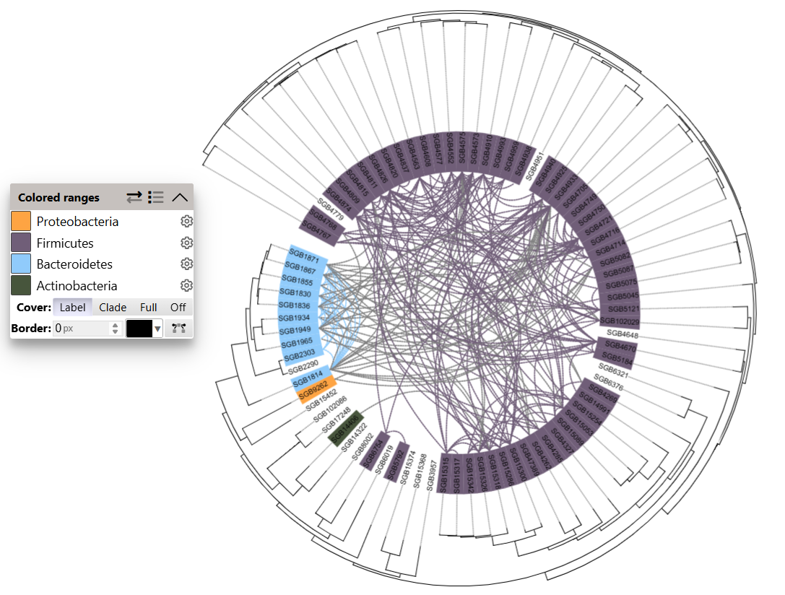

# MetaSAG Usage 
## Step 8. Horizontal Gene Transfer.

## Class：CellHGT(FastaDir,outputDir)
- **Class Function:**

Identify horizontal gene transfer (HGT) between pairwise genome files (species-level).

- **Required Parameters:**
```
FastaDir        --      Path to input genome files.

outputDir       --      Path to save results.

```
- **Example:** See the [Test Usage](#test-usage) section for an example run using the provided test data.

## Func 1：SpeciesHGT()

- **Function Description:**
Calculate HGT between pairwise genome files (species-level) and return an HGT.fasta file.
Requirement: Genome files in FastaDir must be named as SpeciesName.fasta (or SpeciesID.fasta), with no underscores allowed.


Eg. HGT.fasta

```

>PAIR_Species1_ContigIDTOSpecies2_ContigID
CCACCATGTATGACTGGCTTGCCACGATT...
>PAIR_SGB4910_36TOSGB15286_37
GTCTATTGATGAGCAAGGACTGAGCAGTG...
...

```


## Func 2：HGTSpeciesPlot(TreeAnno)

- **Function Description:**

Organize provided tree node information into a data format suitable for plotting phylogenetic trees on the itol web interface.

Eg. TreeAnno
You can directly utilize the `BinAnno` file used by the `MetaSAG_Tree` workflow.

|   File    | SpeciesID |     Phylum     | Phylum_Color |
|:---------:|:---------:|:--------------:|:------------:|
| SGB15452  | SGB15452  | Proteobacteria |   #fea443    |
|  SGB9262  |  SGB9262  | Proteobacteria |   #fea443    |
|  SGB6019  |  SGB6019  |  Fusobacteria  |   #b46b6b    |
| SGB102029 | SGB102029 |   Firmicutes   |   #705E78    |
| SGB14991  | SGB14991  |   Firmicutes   |   #705E78    |
|    ...    |    ...    |      ...       |     ...      |





## Func 3：HGTSpeciesAnno(TreeAnno)

- **Function Description:**

Annotate genes in the HGT.fasta file, cluster them by similarity, and statistically analyze the species involved in each gene cluster.

- **Required Parameter:**
```
TreeAnno        --      Tree node annotation file.

```

- **Optional Parameters:**

```
prokka_env      --      Conda environment for Prokka.
                        Default: None

cdhit_env       --      Conda environment for CD-HIT.
                        Default: None

emapper_env     --      Conda environment for Eggnog-mapper.
                        Default: None

emapper_DB      --      Path to the Eggnog-mapper reference database.
                        Default: None

```


- **Results:**

Eg. ./SpeciesHGTResult/HGTSpeciesAnno/AnnoCDHit/CDHitCluster.txt

|  Cluster  |      Gene      |           Contig            |  Bin1   |  Bin2   |
|:---------:|:--------------:|:---------------------------:|:-------:|:-------:|
| Cluster 0 | HDNNIBCP_01849 |  PAIR_SGB4573_3TOSGB4826_1  | SGB4573 | SGB4826 |
| Cluster 0 | HDNNIBCP_02231 | PAIR_SGB4573_3TOSGB4874_121 | SGB4573 | SGB4874 |
| Cluster 1 | HDNNIBCP_04222 | PAIR_SGB4874_121TOSGB4826_1 | SGB4874 | SGB4826 |
|    ...    |      ...       |             ...             |   ...   |   ...   |


Eg. ./SpeciesHGTResult/HGTSpeciesAnno/AnnoCDHit/ClusterBin.txt

|  Cluster  |         Binlist         |
|:---------:|:-----------------------:|
| Cluster 0 | SGB4874,SGB4573,SGB4826 |
| Cluster 1 |     SGB4874,SGB4826     |
|    ...    |           ...           |


## Func 4：StrainHGT()

- **Function Description:**

Calculate HGT between pairwise genome files (strain-level) and return an HGT.fasta file.
Requirement: Genome files in FastaDir must be named as SpeciesName@StrainID.fasta (or SpeciesID@StrainID.fasta), with no underscores allowed.

Eg. HGT.fasta

```

>PAIR_Species1@Strain2_ContigIDTOSpecies2@Strain0_ContigID
CCACCATGTATGACTGGCTTGCCACGATT...
>PAIR_yw14@strain0_24TOyw90@strain0_14
GGTTCTTGTAGTTGTGGGCCTCGTCCACAAACAGCCGGT
...

```


## Func 5：HGTStrainAnno(TreeAnno)

- **Function Description:**

Annotate genes in the HGT.fasta file, cluster them by similarity, and statistically analyze the strains involved in each gene cluster.

- **Required Parameter:**
```
TreeAnno        --      Tree node annotation file.

```

- **Optional Parameters:**

```
prokka_env      --      Conda environment for Prokka.
                        Default: None

cdhit_env       --      Conda environment for CD-HIT.
                        Default: None

emapper_env     --      Conda environment for Eggnog-mapper.
                        Default: None

emapper_DB      --      Path to the Eggnog-mapper reference database.
                        Default: None

```


```bash
# Execution Command Examples

from MetaSAG import CellHGT as hgt


# Identify horizontal gene transfer sequences between pairwise genomes (species-level) and generate HGT.fasta

fastaDir = Target_Path + 'Bin_QC/Pass/' 

HGTTemp = Target_Path + 'HGT/'


obj=hgt.CellHGT(fastaDir,HGTTemp)

obj.SpeciesHGT()


## Prepare plotting annotation files for the itol web interface

TreeAnno = Target_Path + 'Tree/BinAnno.txt'

obj.HGTSpeciesPlot(TreeAnno)

# Annotate HGT contigs, cluster by similarity, and perform statistical analysis

obj.HGTSpeciesAnno(TreeAnno,prokka_env='prokka',cdhit_env='base',emapper_env='eggnog-mapper2',emapper_DB='/Database/eggnogDB/')

```

## Test Data

This step continues from the Step 6 test and uses the same [`Step_6_8_TestData`](../Example_data/Step_6_8_TestData).

The assembled genomes generated by the previous small test dataset are not sufficient to support phylogenetic tree construction or inter-species horizontal gene transfer analysis. Therefore, Step 6 and Step 8 use this independent test dataset to test the corresponding functions.

Before running this step, complete the Step 6 test first. Step 8 uses the `Tree/BinAnno.txt` generated by Step 6.

Required input from Step 6:

```text
Target_Path/Tree/
└── BinAnno.txt
```

## Test Usage

This test performs species-level HGT analysis based on the `Tree/BinAnno.txt` generated in Step 6.

```python
from MetaSAG import CellHGT as hgt

Target_Path = "Your/Result/Path/"
FastaDir = "../Example_data/Step_6_8_TestData/"

TreeAnno = Target_Path + "Tree/BinAnno.txt"
HGTTemp = Target_Path + "HGT/"

obj = hgt.CellHGT(FastaDir, HGTTemp)

obj.SpeciesHGT()
obj.HGTSpeciesPlot(TreeAnno)
obj.HGTSpeciesAnno(
    TreeAnno,
    prokka_env="prokka",
    cdhit_env="base",
    emapper_env="eggnog-mapper2",
    emapper_DB="/Database/eggnogDB/"
)
```

## Expected Output

Only the key result files are shown below:

```text
Target_Path/HGT/
├── SpeciesHGT/
│   ├── HGT.fasta
│   └── HGTNum.txt
├── HGTSpeciesPlot/
│   ├── HGTNumSpecies.txt
│   ├── HGTNodeAnno.txt      # iTOL node color annotation
│   └── HGTLineAnno.txt      # iTOL HGT connection annotation
└── HGTSpeciesAnno/
    ├── AnnoEggnog/
    │   └── ORFAnno.txt
    └── AnnoCDHit/
        ├── CDHitCluster.txt
        └── ClusterBin.txt
```

To visualize HGT events on the phylogenetic tree, upload the following files to iTOL:

```text
# Tree file generated in Step 6
Target_Path/Tree/TreeTemp/phylogenomic-tree_Bacteria_71_ribosomal6.txt

# HGT connection annotation generated in Step 8
Target_Path/HGT/HGTSpeciesPlot/HGTLineAnno.txt

# Optional node color annotation generated in Step 8
Target_Path/HGT/HGTSpeciesPlot/HGTNodeAnno.txt
```

