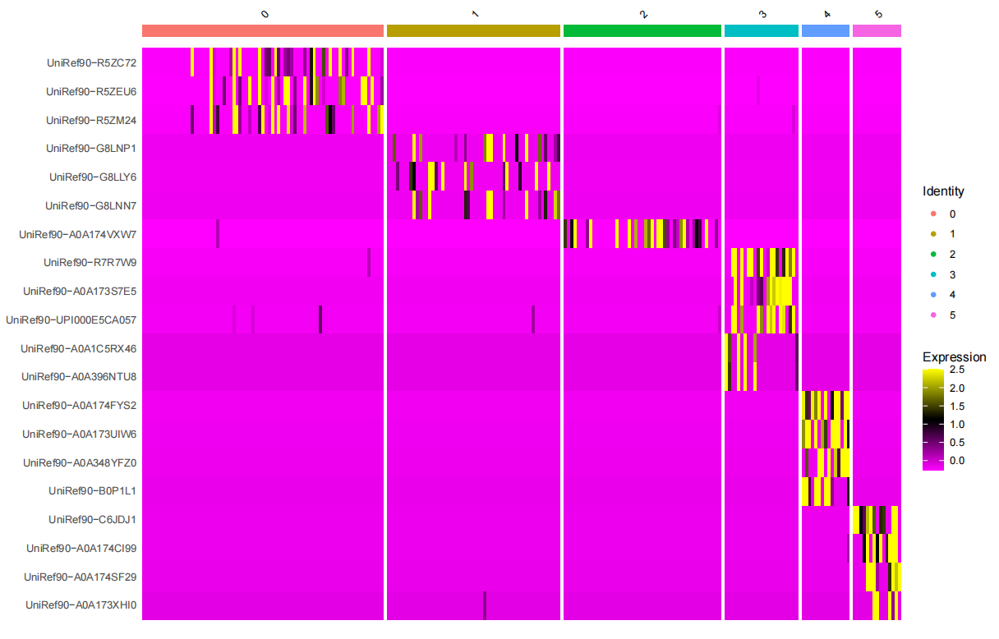
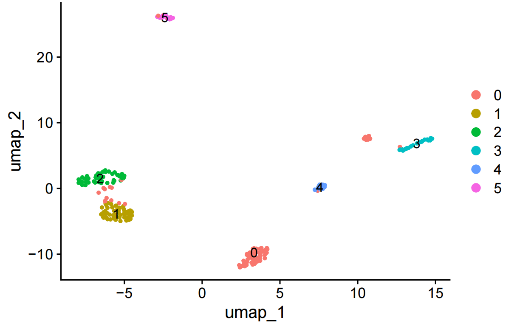
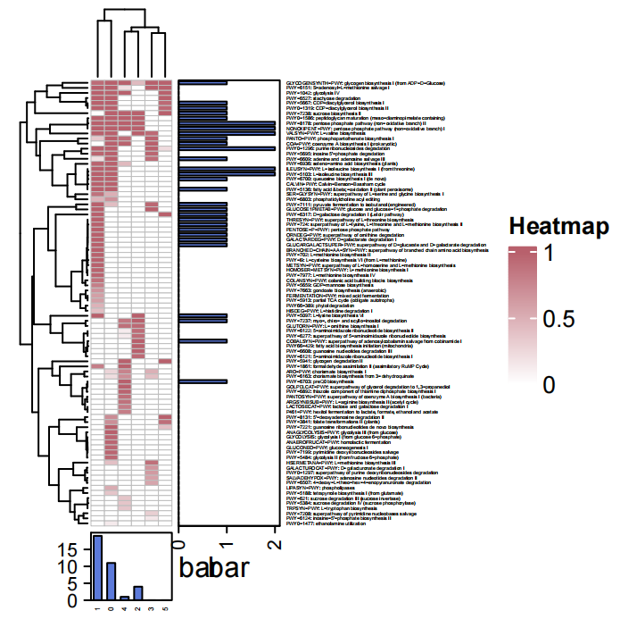

# MetaSAG Usage 
## Step 9. HUMAnN Path.

## Class：HP(FastqDir,ResultDir)
- **Class Function:**

Classifies all sequencing reads and annotates biological pathways using HUMAnN.

- **Required Parameters:**
```

FastqDir        --      Path to the input FASTQ data.
                        Accepts either the absolute path of a single FASTQ file or a directory containing all target files for batch analysis.

ResultDir       --      Path to save the results.

```

## Func 1：Diamond()

- **Function Description:**

Perform Diamond alignment on the FASTQ files under the FastqDir directory.


- **Optional Parameters:**
```
DiamondDB       --      Path to the Diamond reference database.
                        Default: None
                        
Diamondenv      --      Conda environment required for running Diamond.
                        Default: None

```


## Func 2：Uniref2Matrix()

- **Function Description:**

Generates a read count matrix of corresponding Uniref segments in each cell based on Diamond alignment results.


- **Optional Parameters:**

```

MinUnirefNum        --      Minimum count threshold for annotated Uniref reads in a cell.
                            Default: 5
    
MinCellNum          --      Minimum count threshold for the number of cells where Uniref-mapped reads appear.
                            Default: 5

```


## Func 3：SeuratCluster()

- **Function Description:**

Inputs the Cell-Uniref count matrix from Uniref2Matrix to cluster cells using Seurat, generating cell clusters related to Uniref counts.






## Func 4：HUMAnNPath(CellAnno, Group)

- **Function Description:**

Combines cell grouping information from CellAnno and Group to annotate biological pathways for each cell group using HUMAnN based on their Uniref annotations.


- **Required Parameters:**

```
CellAnno        --      Path to the cell grouping information file.

Group           --      Name of the grouping column in CellAnno.
```


- **Optional Parameters:**
```
HUMAnNenv       --      Conda environment required for running HUMAnN.
                        Default: None

ExcludeGroups   --      Specifies groups or bins to be excluded from the analysis (e.g., 'NoSGB'). 
                        Accepts either a single string or a list of strings.
                        Default: None.    
```


Eg. CellAnno (Target_Path/HUMAnNPath/SeuratResult/KnownSGBCell_ClusterCell.txt)

| Cluster |     Cell      |
|:-------:|:-------------:|
|    1    | Sam1025_10012 |
|    1    | Sam1025_10168 |
|    2    | Sam1025_10335 |
|    2    | Sam1025_10713 |
|   ...   |      ...      |


- **Result:**




```bash
# Execution Command Examples

from MetaSAG import HUMAnNPath as hp

# Create an HP object

fastqDir = Target_Path + 'Fastq/'  

resultDir = Target_Path + 'HUMAnNPath/' 

obj=hp.HP(fastqDir,resultDir)

# Perform Diamond alignment on each fastq file

obj.Diamond(DiamondDB = '/Database/uniref/uniref90_201901b_full.dmnd')

# obj.DiamondDir 

# 'Target_Path + 'HUMAnNPath/DiamondDir'
# If the user performs Diamond alignment independently, modify obj.DiamondDir to specify the directory containing Diamond alignment results for subsequent analysis.

# obj.DiamondDir = Target_Path + 'HUMAnNPath/Diamond'

obj.Uniref2Matrix()

obj.SeuratCluster()

cellAnno = Target_Path + 'HUMAnNPath/SeuratResult/KnownSGBCell_ClusterCell.txt'

obj.HUMAnNPath(cellAnno,'Cluster',HUMAnNenv='humann')
```

## Test Data

This step uses the output generated by the Step 1 paired-end test.

Before running this step, run the Step 1 test with the same `Target_Path`.

Required input from Step 1:

```text
Target_Path/Barn/Trim/
└── Test_R1.fastq
```

Required input from Step 3:

```text
Target_Path/MetaPhlAnAsign/MPAsign/
└── CellAnno.txt
```

## Test Usage

```python
from MetaSAG import HUMAnNPath as hp

Target_Path = "Your/Result/Path/"

fastqDir = Target_Path + "Barn/Trim/Test_R1.fastq"
resultDir = Target_Path + "HUMAnNPath/"

obj = hp.HP(fastqDir, resultDir)

obj.Diamond(
    DiamondDB="/Database/uniref/uniref90_201901b_full.dmnd",
    Diamondenv="diamond"
)

obj.Uniref2Matrix()
obj.SeuratCluster()

cellAnno = Target_Path + "MetaPhlAnAsign/MPAsign/CellAnno.txt"

obj.HUMAnNPath(cellAnno, "Cluster", HUMAnNenv="humann")
```

## Expected Output

```text
Target_Path/HUMAnNPath/
├── DiamondDir/
│   └── Test_R1_uniref
├── MatrixDir/
│   ├── Test_R1_CellUnirefCount.txt
│   ├── AllSGBCellUnirefCount.txt
│   └── AllSGB_matrix                       # Core Cell-UniRef matrix used by Seurat
├── SeuratResult/
│   ├── KnownSGBCell_ClusterCell.txt
│   ├── Seurat_Umap.pdf                     # Visualization: Seurat UMAP plot
│   └── Seurat_Pheatmap.pdf                 # Visualization: Seurat marker heatmap
└── HUMAnNResult/
    ├── UnirefForHUMAnN/
    ├── HUMAnNPathForGroup/
    │   └── PathCovCluster.txt              # Core pathway coverage table by group
    └── HeatMapPlot/                        # Visualization: HUMAnN pathway heatmap
```
